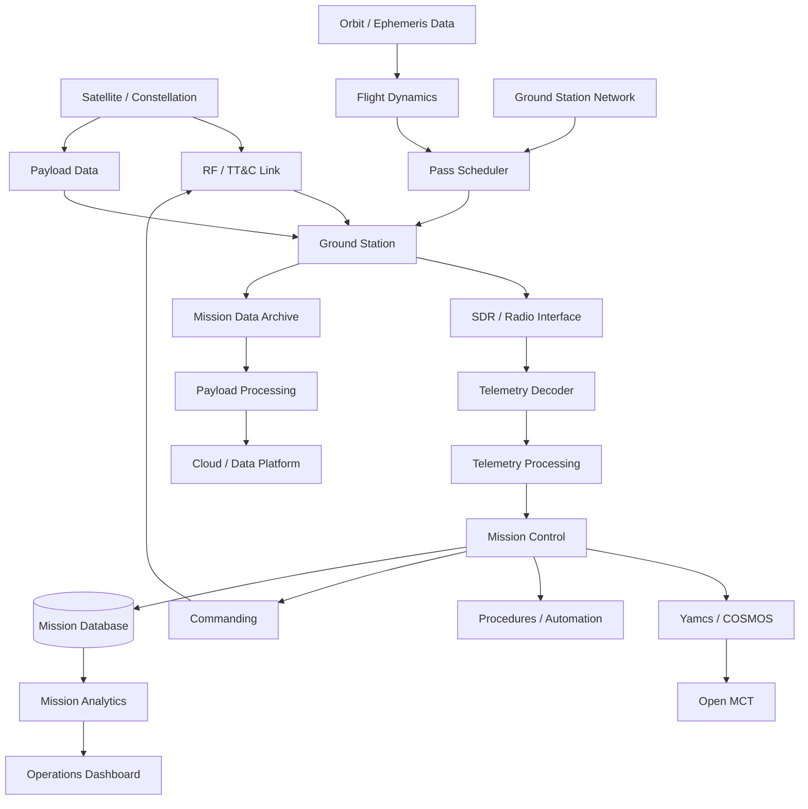
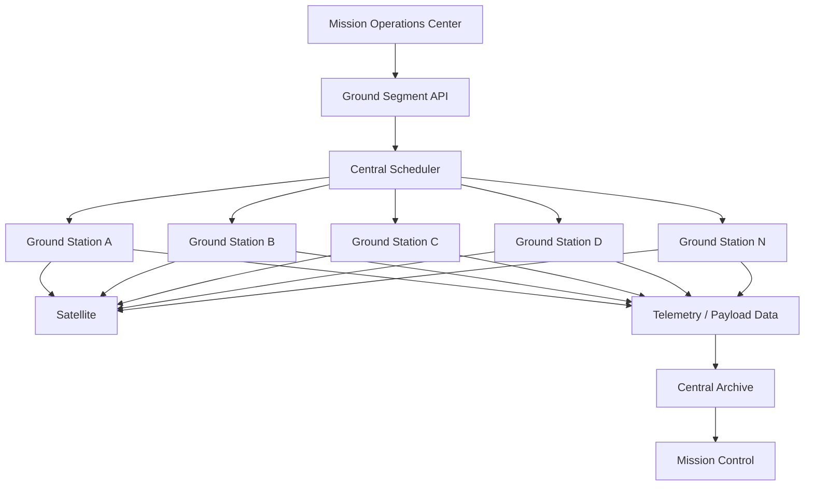
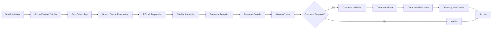
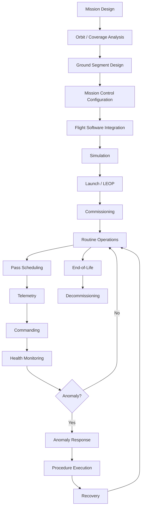

# 🛰️ Awesome Satellite Operations

<p align="left">
  <a href="https://github.com/ishandutta2007/Awesome-Awesome-Awesome"></a>
  <a href="https://discord.gg/jc4xtF58Ve"></a>
  <a href="https://github.com/ishandutta2007/Awesome-Satellite-Operations/stargazers"></a>
  <a href="https://github.com/ishandutta2007/Awesome-Satellite-Operations/network/members"></a>
  <a href="https://github.com/ishandutta2007/Awesome-Satellite-Operations/blob/main/LICENSE"></a>
  <a href="https://github.com/ishandutta2007"></a>
</p>

> **Curated List of SaaS/Hosted Platforms & Open-Source GitHub Projects for Satellite Operations, Ground Segment Management, Mission Control Centers (MOC), Ground Station as a Service (GSaaS), TT&C, Mission Planning, Telemetry Decommutation, Commanding, Pass Scheduling, Constellation Operations & Spacecraft Automation.** 🚀

**Last updated: September 2026** 📅

---

## 📌 Executive Overview & SEO Metadata

Modern **Satellite Operations (SatOps)** and **Ground Segment Management** encompass the end-to-end hardware and software lifecycle required to fly, communicate with, and extract value from orbital spacecraft. These systems coordinate distributed ground-station contacts, command spacecraft, decommutate telemetry, monitor subsystem health, automate flight procedures, manage mega-constellations, plan observation passes, process mission data, and route high-throughput downlinks into cloud data lakes.

Key technical pillars tracked in this ecosystem include:
- 📡 **Ground Station as a Service (GSaaS) & RF Networks**: Multi-tenant global antenna aperture networks offering automated pass scheduling across S-, X-, and Ka-bands with cloud-native edge ingestion.
- 🎛️ **Spacecraft Command & Control (C2) / Mission Control**: Telemetry decommutation, command verification stacks, procedure automation, limits checking, and operator consoles (COSMOS, Yamcs).
- 📜 **CCSDS & Telemetry Protocol Standards**: Space Packet Protocol (SPP), TM/TC Space Data Link Protocols, COP-1, AOS, and CCSDS File Delivery Protocol (CFDP).
- 🧭 **Flight Dynamics & Orbit Propagation**: Numerical and analytical propagators (SGP4, Orekit, GMAT), coordinate transformations, contact window prediction, eclipse modeling, and maneuver optimization.
- 💻 **Spacecraft Flight Software (FSW) & RTOS**: Component-based flight architectures (NASA cFS, NASA JPL F Prime) integrated with real-time operating systems (FreeRTOS, Zephyr).
- 📻 **Software-Defined Radio (SDR) & Signal Processing**: Automated Doppler correction, digital demodulation, frame synchronization, and bit decoding (GNU Radio, SDR++, SatNOGS).
- 🔄 **Constellation Automation & Orchestration**: Conflict-free antenna scheduling, automated anomaly recovery, durable operational procedures, and telemetry streaming architectures (Temporal, Airflow, Kafka, NATS).

---

## 📚 Table of Contents

- 🏢 [SaaS & Hosted Platforms](#-saashosted-platforms)
- 🔓 [Open-Source GitHub Projects](#-open-source-github-projects)
- 🌐 [Open-Source Ground Station Networks](#-open-source-ground-station-networks)
- 🎮 [Open-Source Mission Control & C2](#-open-source-mission-control--c2)
- 🚀 [Open-Source Flight Software](#-open-source-flight-software)
- 🧭 [Open-Source Mission Planning & Flight Dynamics](#-open-source-mission-planning--flight-dynamics)
- 🧪 [Open-Source Satellite Simulation](#-open-source-satellite-simulation)
- 📻 [Open-Source SDR & Ground Communications](#-open-source-sdr--ground-communications)
- 📡 [Open-Source Telemetry & Protocol Tools](#-open-source-telemetry--protocol-tools)
- 🌍 [Open-Source Satellite Tracking & Orbit Propagation](#-open-source-satellite-tracking--orbit-propagation)
- 📦 [Open-Source Mission Data Processing](#-open-source-mission-data-processing)
- 📊 [Open-Source Analytics & Visualization](#-open-source-analytics--visualization)
- ⚙️ [Open-Source Workflow & Automation](#-open-source-workflow--automation)
- 🔄 [Commercial Satellite Operations → Open-Source Equivalents](#-commercial-satellite-operations--open-source-equivalents)
- 🏗️ [Frameworks for Building Custom Satellite Operations Systems](#%EF%B8%8F-frameworks-for-building-custom-satellite-operations-systems)
- 📐 [Reference Satellite Operations Architecture](#-reference-satellite-operations-architecture)
- 📡 [Distributed Ground Station Architecture](#-distributed-ground-station-architecture)
- 🔄 [Typical Satellite Contact Workflow](#-typical-satellite-contact-workflow)
- 🛸 [Mission Operations Lifecycle](#-mission-operations-lifecycle)
- 🛰️ [Constellation Operations](#%EF%B8%8F-constellation-operations)
- 📋 [Ground Station Scheduling](#-ground-station-scheduling)
- 🗄️ [Open-Source Data Model](#%EF%B8%8F-open-source-data-model)
- 💾 [Mission Operations Database](#-mission-operations-database)
- 📊 [Open-Source Capability Matrix](#-open-source-capability-matrix)
- 💡 [Recommended Open-Source Stacks](#-recommended-open-source-stacks)
- 🎯 [Strongest Open-Source Combination](#-strongest-open-source-combination)
- ❓ [What Is Still Difficult to Reproduce in Open Source?](#-what-is-still-difficult-to-reproduce-in-open-source)
- ⚖️ [Open Source vs GSaaS](#%EF%B8%8F-open-source-vs-gsaas)
- 🔀 [Hybrid Open-Source Ground Segment](#-hybrid-open-source-ground-segment)
- 🔌 [Ground Station as a Service API](#-ground-station-as-a-service-api)
- 🤖 [Autonomous Satellite Operations](#-autonomous-satellite-operations)
- 🧠 [AI/ML for Satellite Operations](#-aiml-for-satellite-operations)
- ♊ [Mission Operations Digital Twin](#-mission-operations-digital-twin)
- 🗺️ [Open-Source Capability Mapping](#%EF%B8%8F-open-source-capability-mapping)
- 🚀 [Best Open-Source Starting Points](#-best-open-source-starting-points)
- 🏆 [Overall Open-Source Recommendation](#-overall-open-source-recommendation)
- 📈 [Star History](#-star-history)
- 🤝 [How to Contribute](#-how-to-contribute)
- ⚠️ [Disclaimer](#%EF%B8%8F-disclaimer)

---

## 🏢 SaaS & Hosted Platforms

> 📊 **Market Overview & Industry Structure**: The global **Satellite Operations, Ground Segment as a Service (GSaaS), and Mission Control Software** market is estimated at **$4.2 Billion to $6.8 Billion (2026)** and is projected to exceed **$12.5 Billion by 2032 (CAGR ~16.8%)**, fueled by the explosion of LEO megaconstellations, Earth observation downlinks, and software-defined spacecraft. The sector exhibits a **moderately fragmented market structure**: heavy physical capital expenditures for high-throughput ground antennas create regional concentration among legacy network operators (KSAT, SSC, Viasat) and hyperscale cloud providers (AWS, Azure), while mission planning, scheduling, telemetry, and software-defined C2 software support a rapidly proliferating, competitive ecosystem of specialized NewSpace SaaS challenger platforms (Leaf Space, ATLAS Space Operations, Infostellar, Antaris).

The table below lists leading commercial SaaS/hosted satellite operations platforms, **sorted by Company Size (Valuation / Revenue descending)**:

| 🚀 Platform / Product | 📊 Company Size (Valuation / Revenue) | 📝 Description | 💰 Starting Pricing | 🎁 Free Tier / Trial Limits |
| :--- | :--- | :--- | :--- | :--- |
| **[Microsoft Azure Orbital](https://azure.microsoft.com/en-us/products/orbital/)** | **$245B Rev / $3.1T Mkt Cap** (Microsoft) | Azure-based satellite ground-station and space-data service designed to connect spacecraft directly with cloud computing and data-processing infrastructure. | Starting at **$0.22/minute** (narrowband partner downlinks) up to **$10.00/minute** (on-demand direct antenna contact; reserved commitments from $3.00/minute) | **30-day Azure free trial** with $200 cloud credits; 0 free orbital contact minutes included (spacecraft requires FCC/ITU spectrum clearance and NORAD ID validation) |
| **[AWS Ground Station](https://aws.amazon.com/ground-station/)** | **$105B AWS ARR / $2.0T Mkt Cap** (Amazon) | Managed ground-station service from AWS providing on-demand satellite communications and direct integration with AWS cloud services. | **$3.00/minute** (Narrowband ≤54 MHz, Reserved commitment of 150 min/month) or **$10.00/minute** (Narrowband On-Demand); **$22.00/minute** (Wideband >54 MHz On-Demand) | **12-month AWS Free Tier** ($300 promotional credit for new accounts); 0 free antenna minutes included (charges accrue per scheduled minute; requires verified satellite licensing) |
| **[Viasat Real-Time Earth](https://www.viasat.com/)** | **$4.5B Rev / $2.5B Mkt Cap** (Viasat, Inc.) | Commercial Ground Segment as a Service network offering high-rate S-, X-, and Ka-band downlinks, TT&C, and automated machine-to-machine pass scheduling into cloud infrastructure. | Starting at **$15.00 – $25.00/minute** (or ~$150 – $250 per 10-minute pass), with baseline dedicated mission packages from **$5,000/month** | No free-forever plan; **0-day public trial** (technical RF link compatibility analysis and pass simulation provided during onboarding) |
| **[Kratos EPOCH](https://www.kratosspace.com/products/satellites/command-and-control/epoch-ips)** | **$1.1B Rev / $2.8B Mkt Cap** (Kratos Defense) | Enterprise satellite command-and-control (C2) and fleet management suite providing telemetry/command processing, automated procedures, archiving, and multi-mission operations across 300+ deployed missions. | Starting at **$50,000 – $85,000/year** base enterprise license (~$9,570 for individual module add-ons under GSA IT Schedule) | No free-forever plan; **0-day public trial** (custom 30-day proof-of-concept evaluation and virtual demo environment available for qualified satellite operators) |
| **[KSAT](https://www.ksat.no/)** | **~$180M Rev / $1.2B Valuation** (Kongsberg Satellite Services) | Large-scale commercial ground-station network providing TT&C, payload-data reception, mission support and ground-segment services, including polar stations Svalbard and TrollSat. | Starting at **€350 – €600 per pass** for high-reliability polar aperture contacts, or annual enterprise mission support starting at **€40,000/year** | No free-forever plan; **0-day public trial** (pre-mission feasibility pass simulation and link budget modeling provided during contract scoping) |
| **[KSATlite](https://www.ksat.no/services/ksatlite/)** | **~$180M Rev / $1.2B Valuation** (KSAT Kongsberg) | KSAT's global ground-station service aimed at smallsat and constellation operators, providing optimized ground-station access and satellite communications with standardized 3.7m antennas. | Starting at **€150 – €300 per pass** (standard 10–12 minute S/X-band contact) or **€3,000/month** baseline constellation bundle | No free-forever plan; **0-day public trial** (14-day API staging sandbox and simulated contact scheduling available upon sales consultation) |
| **[SSC](https://sscspace.com/)** | **~$150M Rev / $800M Enterprise Value** (Swedish Space Corp) | Swedish Space Corporation provides satellite ground-station networks (SSC Connect & SSC Infinity), TT&C, mission operations and ground-segment services. | Starting at **€200 – €350 per pass** (SSC Infinity smallsat network) or **€500 – €900 per pass** for high-aperture polar antennas (Kiruna/Santiago) | No free-forever plan; **0-day public trial** (0 free live passes; pre-flight contact simulation and RF link verification during mission setup) |
| **[Orbit Logic](https://orbitlogic.com/)** | **~$25M ARR / $150M Valuation** (Boecore / Auria) | Space-mission planning and scheduling technology (including STK Scheduler, CPAW, and Order Logic) covering satellite operations, mission planning, resource scheduling and constellation operations. | Starting at **$15,000 – $25,000/year** per software seat license (or starting from $1,250/month commercial license tiers) | No free-forever plan; **30-day evaluation trial license** available for accredited aerospace engineers and government program evaluators |
| **[ATLAS Space Operations](https://www.atlas.space/)** | **~$15M ARR / $90M Valuation** (ATLAS Freedom) | Ground-segment infrastructure and GSaaS platform providing satellite operators with access to distributed ground stations through the ATLAS Freedom platform and APIs. | Starting at **$2,500/month** base platform subscription (~$150 – $280 per scheduled contact pass) | No free-forever plan; **0-day public trial** (14-day API sandbox and simulation pass testing upon technical onboarding) |
| **[Atlas Ground Station Network](https://www.atlas.space/)** | **~$15M ARR / $90M Valuation** (ATLAS Space Operations) | Cloud-managed ground-station network with API-oriented scheduling, automated RF modems, and communications infrastructure operated by ATLAS Space Operations. | Starting at **$150 – $280 per pass** (or ~$15 – $25/minute on-demand), with monthly network availability retainers from **$2,500/month** | No free-forever plan; **0-day public trial** (API pass integration sandbox provided during mission onboarding; 0 free live antenna passes) |
| **[Leaf Space](https://leaf.space/)** | **~$10M ARR / $60M Valuation** (Leaf Space S.p.A.) | Ground Segment as a Service provider offering globally distributed ground stations, automated/on-demand scheduling, TT&C and payload-data connectivity through a unified interface across 40+ active antennas. | Starting at **€2.00 – €3.50/minute** (pay-as-you-go antenna contact time) or **€500/month** entry operational tier (volume discounts available) | No free-forever plan; **0-day public trial** (complimentary RF link compatibility analysis and pre-launch simulated pass verification during mission onboarding) |
| **[Scout Space](https://www.scout.space/)** | **~$8M ARR / $50M Valuation** (SCOUT Space Inc.) | Space-domain-awareness and satellite-operations company developing space-based sensing, optical detection (Owl), autonomous flight software, and SpaceSight™ data intelligence platforms. | Starting at **$2,000/month** ($24,000/year base data feed subscription) for commercial orbital tracking and space-domain intelligence reports | No free-forever plan; **0-day public trial** (sample orbital ephemeris and conjunction dataset available upon request for accredited operators) |
| **[RBC Signals](https://rbcsignals.com/)** | **~$8M ARR / $45M Valuation** (RBC Signals, LLC) | Ground-station and satellite-communications marketplace providing access to distributed antennas and mission-support infrastructure. | **$19.95 per pass** (RBC Signals Xpress X-band downlink) with a **$595/month** minimum engagement fee; multi-band TT&C passes start at **$120 – $250/pass** | No free-forever plan; **0-day public trial** (pre-mission link assessment and 1 free simulated API pass reservation upon contract onboarding) |
| **[Antaris](https://www.antaris.space/)** | **~$5M ARR / $45M Valuation** (Antaris Space) | Cloud-based space mission virtualization and operations platform supporting mission design, simulation, ground-segment integration, automated CONOPS and software-driven satellite/constellation operations. | Starting at **$2,500/month** ($30,000/year annual project agreement) for core TrueTwin simulation and mission design environments | No free-forever plan; **14-day interactive TrueTwin web sandbox** trial on request (supports 1 virtualized satellite model) |
| **[Infostellar / StellarStation](https://www.infostellar.net/)** | **~$6M ARR / $40M Valuation** (Infostellar Inc.) | Cloud-based satellite ground-segment platform aggregating distributed commercial and university antennas for scalable LEO constellation communications. | Starting at **$100 – $200 per pass** (pay-as-you-go) or **$1,000/month** basic capacity plan; antenna owners earn credits by sharing idle antenna windows | No free-forever plan; **30-day developer sandbox access** with up to 5 simulated API pass schedules (requires satellite transmission registration) |

---

## 🔓 Open-Source GitHub Projects

> ⭐️ **Sorted by GitHub_Stars (Descending)**. Every star badge links directly to the stargazers page of that repository.

* **[Grafana](https://github.com/grafana/grafana)** [](https://github.com/grafana/grafana/stargazers)
  Open-source visualization and operational dashboard engine for telemetry and ground station metrics.

* **[Prometheus](https://github.com/prometheus/prometheus)** [](https://github.com/prometheus/prometheus/stargazers)
  Time-series monitoring and alerting system for ground stations, antenna modems, and mission servers.

* **[Apache Airflow](https://github.com/apache/airflow)** [](https://github.com/apache/airflow/stargazers)
  Data pipeline workflow orchestrator for orbit propagation, ground contact, and payload pipelines.

* **[DuckDB](https://github.com/duckdb/duckdb)** [](https://github.com/duckdb/duckdb/stargazers)
  In-process analytical database engine for high-performance satellite telemetry queries and pass analysis.

* **[Prefect](https://github.com/prefecthq/prefect)** [](https://github.com/prefecthq/prefect/stargazers)
  Workflow orchestration platform for modern mission data workflows and ETL pipelines.

* **[Node-RED](https://github.com/node-red/node-red)** [](https://github.com/node-red/node-red/stargazers)
  Low-code event-driven ground-system and hardware automation platform.

* **[Temporal](https://github.com/temporalio/temporal)** [](https://github.com/temporalio/temporal/stargazers)
  Durable workflow orchestration engine for resilient pass scheduling, command execution, and anomaly response.

* **[NATS](https://github.com/nats-io/nats-server)** [](https://github.com/nats-io/nats-server/stargazers)
  Cloud-native messaging system for low-latency ground-station-to-MOC telemetry distribution.

* **[Apache Arrow](https://github.com/apache/arrow)** [](https://github.com/apache/arrow/stargazers)
  Cross-language development platform for in-memory columnar telemetry data processing.

* **[Zephyr](https://github.com/zephyrproject-rtos/zephyr)** [](https://github.com/zephyrproject-rtos/zephyr/stargazers)
  Modular open-source RTOS designed for embedded microcontrollers, IoT, and modern NewSpace flight computers.

* **[Dagster](https://github.com/dagster-io/dagster)** [](https://github.com/dagster-io/dagster/stargazers)
  Data orchestrator for satellite payload processing and telemetry archiving pipelines.

* **[NASA Open MCT](https://github.com/nasa/openmct)** [](https://github.com/nasa/openmct/stargazers)
  NASA's open-source web-based mission control visualization framework for next-generation operations.

* **[NASA F Prime](https://github.com/nasa/fprime)** [](https://github.com/nasa/fprime/stargazers)
  NASA JPL's component-driven flight software framework for CubeSats, robotic instruments, and small spacecraft.

* **[Mosquitto](https://github.com/eclipse-mosquitto/mosquitto)** [](https://github.com/eclipse-mosquitto/mosquitto/stargazers)
  Lightweight MQTT message broker for distributed ground equipment and telemetry transport.

* **[FreeRTOS](https://github.com/FreeRTOS/FreeRTOS)** [](https://github.com/FreeRTOS/FreeRTOS/stargazers)
  Market-leading real-time operating system (RTOS) widely deployed on spacecraft onboard computers (OBCs).

* **[SDR++](https://github.com/AlexandreRouma/SDRPlusPlus)** [](https://github.com/AlexandreRouma/SDRPlusPlus/stargazers)
  Cross-platform, high-performance SDR receiver software for satellite telemetry and RF reception.

* **[GNU Radio](https://github.com/gnuradio/gnuradio)** [](https://github.com/gnuradio/gnuradio/stargazers)
  Software-defined radio and signal processing framework powering open-source satellite ground stations.

* **[Astropy](https://github.com/astropy/astropy)** [](https://github.com/astropy/astropy/stargazers)
  Core astronomy and celestial coordinate library used for spacecraft tracking, pointing, and ephemerides.

* **[xarray](https://github.com/pydata/xarray)** [](https://github.com/pydata/xarray/stargazers)
  N-D labeled array data structures for satellite remote sensing, weather payloads, and telemetry datasets.

* **[Gqrx](https://github.com/gqrx-sdr/gqrx)** [](https://github.com/gqrx-sdr/gqrx/stargazers)
  Open-source software-defined radio receiver powered by GNU Radio and the Qt graphical user interface.

* **[Apache Parquet](https://github.com/apache/parquet-format)** [](https://github.com/apache/parquet-format/stargazers)
  Apache Parquet columnar storage format specification widely used for historical telemetry data lakes.

* **[MAVLink](https://github.com/mavlink/mavlink)** [](https://github.com/mavlink/mavlink/stargazers)
  Lightweight message marshaling protocol for communicating with robotic spacecraft and aerial vehicles.

* **[Zarr](https://github.com/zarr-developers/zarr-python)** [](https://github.com/zarr-developers/zarr-python/stargazers)
  Chunked, compressed N-dimensional array storage for high-volume satellite payload archives.

* **[Skyfield](https://github.com/skyfielders/python-skyfield)** [](https://github.com/skyfielders/python-skyfield/stargazers)
  High-precision Python astronomy library for satellite tracking, ephemeris calculations, and contact predictions.

* **[SoapySDR](https://github.com/pothosware/SoapySDR)** [](https://github.com/pothosware/SoapySDR/stargazers)
  Vendor and platform neutral SDR hardware abstraction layer used across satellite ground stations.

* **[NASA cFS](https://github.com/nasa/cFS)** [](https://github.com/nasa/cFS/stargazers)
  NASA's Core Flight System reusable flight software architecture and flight-proven component framework.

* **[Satpy](https://github.com/pytroll/satpy)** [](https://github.com/pytroll/satpy/stargazers)
  Python library for reading, manipulating, and writing earth-observing satellite remote-sensing data.

* **[Gpredict](https://github.com/csete/gpredict)** [](https://github.com/csete/gpredict/stargazers)
  Real-time satellite tracking and orbit propagation application supporting antenna rotators and radio Doppler tuning.

* **[satellite.js](https://github.com/shashwatak/satellite-js)** [](https://github.com/shashwatak/satellite-js/stargazers)
  Modular JavaScript satellite orbit propagation library implementing SGP4/SDP4 for web-based mission control.

* **[poliastro](https://github.com/poliastro/poliastro)** [](https://github.com/poliastro/poliastro/stargazers)
  Pure Python astrodynamics library focused on interplanetary trajectories and orbital mechanics.

* **[gr-satellites](https://github.com/daniestevez/gr-satellites)** [](https://github.com/daniestevez/gr-satellites/stargazers)
  GNU Radio telemetry decoders for smallsats, CubeSats, and amateur radio spacecraft.

* **[NASA NOS3](https://github.com/nasa/nos3)** [](https://github.com/nasa/nos3/stargazers)
  NASA Operational Simulator for Small Satellites, integrating software-in-the-loop and hardware-in-the-loop testing.

* **[Cesium Native](https://github.com/cesiumgs/cesium-native)** [](https://github.com/cesiumgs/cesium-native/stargazers)
  Native 3D geospatial runtime for high-performance satellite constellation and orbit visualization.

* **[python-sgp4](https://github.com/brandon-rhodes/python-sgp4)** [](https://github.com/brandon-rhodes/python-sgp4/stargazers)
  Standard Python implementation of SGP4/SDP4 satellite orbit propagation from TLEs and OMMs.

* **[42 Spacecraft Simulator](https://github.com/ericstoneking/42)** [](https://github.com/ericstoneking/42/stargazers)
  Spacecraft attitude, orbit dynamics, and multi-body simulation environment developed by NASA.

* **[Basilisk](https://github.com/AVSLab/basilisk)** [](https://github.com/AVSLab/basilisk/stargazers)
  High-fidelity modular spacecraft attitude and orbital dynamics simulation framework developed at CU Boulder.

* **[Yamcs](https://github.com/yamcs/yamcs)** [](https://github.com/yamcs/yamcs/stargazers)
  Open-source mission control and command, control, and communication (C3) system with native CCSDS support.

* **[OpenSatKit](https://github.com/OpenSatKit/OpenSatKit)** [](https://github.com/OpenSatKit/OpenSatKit/stargazers)
  Complete open-source satellite software kit integrating NASA cFS with OpenC3 COSMOS for I&T and flight operations.

* **[Orekit](https://github.com/CS-SI/Orekit)** [](https://github.com/CS-SI/Orekit/stargazers)
  Comprehensive space flight dynamics library providing orbit propagation, maneuvers, attitude, and ground visibility.

* **[pyorbital](https://github.com/pytroll/pyorbital)** [](https://github.com/pytroll/pyorbital/stargazers)
  Python library for orbital computations, satellite ephemerides, and ground-station pass prediction.

* **[OpenC3 COSMOS](https://github.com/OpenC3/cosmos)** [](https://github.com/OpenC3/cosmos/stargazers)
  User-extensible command and control system providing real-time telemetry decommutation, commanding, and scripting.

* **[SatNOGS Network](https://github.com/satnogs/satnogs-network)** [](https://github.com/satnogs/satnogs-network/stargazers)
  Crowdsourced global network platform for distributed ground station coordination and observation scheduling.

* **[SatNOGS Rotator](https://github.com/satnogs/satnogs-rotator)** [](https://github.com/satnogs/satnogs-rotator/stargazers)
  Open-source antenna rotator controller firmware and mechanical designs for satellite tracking.

* **[NASA GMAT](https://github.com/ChristopherRabotin/GMAT)** [](https://github.com/ChristopherRabotin/GMAT/stargazers)
  NASA's General Mission Analysis Tool for trajectory design, mission planning, and orbit optimization.

* **[SatNOGS Software](https://github.com/satnogs/satnogs-software)** [](https://github.com/satnogs/satnogs-software/stargazers)
  Software stack and tools for running automated SatNOGS ground station nodes.

* **[gr-satnogs](https://github.com/satnogs/gr-satnogs)** [](https://github.com/satnogs/gr-satnogs/stargazers)
  SatNOGS GNU Radio out-of-tree module containing blocks and flowgraphs for decoding satellite signals.

---

## 🌐 Open-Source Ground Station Networks

### SatNOGS
**[SatNOGS](https://satnogs.org/)** is the premier open-source global ground-station network, developed by the Libre Space Foundation. Its modular stack includes station client software, global observation scheduling, a crowdsourced satellite database, and rotator control.
- **Client**: Connects antenna hardware, rotators, and SDRs with automated scheduling.
- **Network Scheduler**: Distributes pass requests across hundreds of worldwide stations.
- **Observation DB**: Public repository of decoded RF signals, telemetry frames, and waterfall spectrograms.

---

## 🎮 Open-Source Mission Control & C2

### OpenC3 COSMOS
**[OpenC3 COSMOS](https://github.com/OpenC3/cosmos)** is a command and control system supporting telemetry decommutation, command generation, procedural scripting, limit checking, and display widgets across serial, TCP/UDP, MQTT, and CCSDS interfaces.

### Yamcs
**[Yamcs](https://github.com/yamcs/yamcs)** is an enterprise C3 framework built for complex space missions, providing native CCSDS support, command stacks, parameter archives, mission timelines, and web-based telemetry displays.

### NASA Open MCT
**[Open MCT](https://github.com/nasa/openmct)** is NASA's web-based mission-control visualization framework, providing customizable telemetry dashboards, time-series plotting, and mission planning consoles.

---

## 🚀 Open-Source Flight Software

### NASA cFS
**[Core Flight System (cFS)](https://github.com/nasa/cFS)** provides a flight-proven, reusable software architecture containing a platform abstraction layer (OSAL), core flight executive (cFE), and modular satellite service apps.

### NASA JPL F Prime
**[F Prime](https://github.com/nasa/fprime)** is a component-driven flight software framework tailored for small satellites and CubeSats, offering automated code generation, typed ports, and ground-data interfaces.

---

## 🧭 Open-Source Mission Planning & Flight Dynamics

### Orekit
**[Orekit](https://github.com/CS-SI/Orekit)** is a space-flight-dynamics library providing orbit propagation (analytical, numerical, and semi-analytical DSST), maneuver planning, eclipse events, ground-station visibility, and celestial frame transformations.

### NASA GMAT
**[General Mission Analysis Tool (GMAT)](https://github.com/ChristopherRabotin/GMAT)** is NASA's trajectory optimization and mission-analysis suite for deep-space and Earth-orbital mission design.

---

## 🧪 Open-Source Satellite Simulation

### Basilisk
**[Basilisk](https://github.com/AVSLab/basilisk)** is a fast spacecraft simulation framework developed by the Autonomous Vehicle Systems (AVS) Laboratory at the University of Colorado Boulder, supporting complex multi-body attitude dynamics, sensor models, and flight software integration.

### NASA NOS3
**[NASA NOS3](https://github.com/nasa/nos3)** provides a software-in-the-loop and hardware-in-the-loop simulation environment for small satellite development, combining 42 orbital dynamics with NASA cFS.

---

## 📻 Open-Source SDR & Ground Communications

### GNU Radio & gr-satellites
- **[GNU Radio](https://github.com/gnuradio/gnuradio)**: Foundational digital signal processing and software-defined radio toolkit.
- **[gr-satellites](https://github.com/daniestevez/gr-satellites)**: Comprehensive collection of decoders for telemetry beacons from amateur and smallsat spacecraft.
- **[SDR++](https://github.com/AlexandreRouma/SDRPlusPlus)**: High-performance cross-platform SDR GUI with wide hardware driver support.

---

## 📡 Open-Source Telemetry & Protocol Tools

- **CCSDS Implementation**: Open-source implementations of Space Packet Protocol (SPP) and Telecommand/Telemetry transfer frames in Yamcs and COSMOS.
- **MQTT / NATS**: High-performance message brokers for routing telemetry packets between ground stations and cloud MOC nodes.

---

## 🌍 Open-Source Satellite Tracking & Orbit Propagation

- **[Gpredict](https://github.com/csete/gpredict)**: Real-time satellite tracking, Doppler tuning, and antenna rotator steering.
- **[Skyfield](https://github.com/skyfielders/python-skyfield)** & **[python-sgp4](https://github.com/brandon-rhodes/python-sgp4)**: High-precision orbital tracking and ephemeris calculations.
- **[satellite.js](https://github.com/shashwatak/satellite-js)**: In-browser SGP4 propagation for lightweight web consoles.

---

## 📦 Open-Source Mission Data Processing

- **[Satpy](https://github.com/pytroll/satpy)**: Reading, calibration, and atmospheric correction for meteorological and remote-sensing satellite imagery.
- **[xarray](https://github.com/pydata/xarray)** & **[Zarr](https://github.com/zarr-developers/zarr-python)**: Scalable chunked multi-dimensional arrays for Earth observation data stores.

---

## 📊 Open-Source Analytics & Visualization

- **[Open MCT](https://github.com/nasa/openmct)**: Operator mission control consoles and telemetry stream visualization.
- **[Grafana](https://github.com/grafana/grafana)**: Operational monitoring for ground-station health, contact success metrics, and RF link budgets.

---

## ⚙️ Open-Source Workflow & Automation

- **[Temporal](https://github.com/temporalio/temporal)**: Durable workflow execution for critical pass execution, command verification, and anomaly response.
- **[Apache Airflow](https://github.com/apache/airflow)** & **[Dagster](https://github.com/dagster-io/dagster)**: Batch data pipeline orchestration for automated science data processing.

---

## 🔄 Commercial Satellite Operations → Open-Source Equivalents

| Commercial Platform | Primary Focus | Strong Open-Source Equivalents / Building Blocks |
| :--- | :--- | :--- |
| **Kratos EPOCH** | Enterprise satellite C2 / mission operations | OpenC3 COSMOS + Yamcs + Open MCT + cFS |
| **ATLAS Space Operations** | Ground-station network / GSaaS | SatNOGS + custom scheduling + GNU Radio |
| **Leaf Space** | GSaaS / ground-station network | SatNOGS + SatNOGS Network + custom RF infrastructure |
| **Infostellar / StellarStation** | Cloud ground-segment orchestration | SatNOGS + Kubernetes + custom APIs |
| **Azure Orbital** | Cloud-connected satellite ground stations | SatNOGS + Kubernetes + object storage + cloud APIs |
| **AWS Ground Station** | Managed satellite ground-station service | SatNOGS + GNU Radio + SDR + cloud infrastructure |
| **KSATlite** | Distributed ground-station access | SatNOGS + custom ground stations + scheduler |
| **Orbit Logic** | Mission planning / scheduling | Orekit + GMAT + Basilisk + custom scheduler |
| **Antaris** | Virtualized mission design / simulation / operations | cFS + F Prime + Yamcs + Orekit + Basilisk |
| **Scout Space** | Space-domain awareness / satellite sensing | Open MCT + Orekit + SatNOGS + OpenSearch + custom sensors |

> **Important:** These are **capability-oriented mappings**, not feature-for-feature replacements. Commercial platforms combine proprietary ground infrastructure, RF hardware, network operations, mission-control software, service-level guarantees, cybersecurity, mission support and operational expertise that cannot be reproduced simply by installing one open-source package.

---

## 🏗️ Frameworks for Building Custom Satellite Operations Systems

A practical open-source satellite-operations stack can be assembled using:

| Layer | Open-Source Technologies |
| :--- | :--- |
| Ground Network | SatNOGS |
| Ground Station Client | SatNOGS Client |
| Scheduling | SatNOGS Network · custom scheduler |
| Mission Control | OpenC3 COSMOS · Yamcs |
| Visualization | Open MCT · Cesium |
| Flight Software | NASA cFS · F Prime · Zephyr · FreeRTOS |
| Simulation | Basilisk · NOS3 · 42 |
| Flight Dynamics | Orekit · GMAT · poliastro |
| Orbit Propagation | SGP4 · Skyfield · satellite.js |
| SDR | GNU Radio · SDR++ · Gqrx |
| Satellite Decoding | gr-satellites · gr-satnogs |
| RF Abstraction | SoapySDR |
| Telemetry | Yamcs · COSMOS · cFS |
| Commanding | Yamcs · COSMOS · cFS |
| Protocols | CCSDS · MQTT · UDP/TCP · MAVLink |
| Event Streaming | Kafka · NATS |
| Messaging | MQTT · Mosquitto |
| Database | PostgreSQL |
| Time-Series Data | InfluxDB · TimescaleDB |
| Analytics | DuckDB · Polars · Pandas |
| Mission Data | Satpy · xarray · Zarr |
| Object Storage | MinIO |
| Workflow | Temporal · Airflow · Dagster · Prefect |
| Automation | Node-RED |
| Dashboards | Grafana · Open MCT |
| Monitoring | Prometheus |
| Search | OpenSearch |
| Authentication | Keycloak · Authentik |
| Deployment | Docker · Kubernetes |

---

## 📐 Reference Satellite Operations Architecture



---

## 📡 Distributed Ground Station Architecture



This architecture is conceptually close to the distributed model demonstrated by SatNOGS, where multiple ground stations are coordinated through a shared network and scheduling layer.

---

## 🔄 Typical Satellite Contact Workflow



---

## 🛸 Mission Operations Lifecycle



---

## 🛰️ Constellation Operations

A modern constellation-control system needs to manage:
- Hundreds or thousands of spacecraft
- Multiple orbital planes
- Multiple ground stations
- Frequent contacts
- Autonomous procedures
- Telemetry streams
- Command queues
- Software versions
- Configuration versions
- Spacecraft states
- Ground-station availability
- Conflicting contact requests

A suitable open-source architecture is:
**SatNOGS / Scheduler + Orekit + Yamcs/COSMOS + Kafka/NATS + PostgreSQL + Open MCT + Grafana**

---

## 📋 Ground Station Scheduling

A production scheduler should consider:

| Constraint | Example |
| :--- | :--- |
| Visibility | Satellite above elevation threshold |
| Frequency | UHF / S / X / Ka |
| Antenna | Available antenna |
| Location | Ground-station site |
| Polarization | RHCP / LHCP |
| Modulation | Mission-specific |
| Contact duration | Minimum/maximum pass |
| Priority | Critical command vs payload downlink |
| Conflicts | Two spacecraft requesting one antenna |
| Weather | Site-specific RF constraints |
| Maintenance | Ground-station outage |
| Data volume | Downlink capacity |
| Orbit | LEO / MEO / GEO / deep space |

---

## 🗄️ Open-Source Data Model

A production satellite-operations system models at least the following:

### Spacecraft
- Spacecraft ID, NORAD ID, COSPAR ID
- Mission, Bus, Payload, Orbit, Status
- Software version, Configuration version, Owner, Operational state

### Ground Station
- Ground station ID, Location, Latitude, Longitude
- Antenna, Frequency bands, Modulation, RF chains
- Availability, Maintenance status, Network endpoint

### Contact Window
- Contact ID, Spacecraft, Ground station
- AOS, LOS, Maximum elevation, Duration, Priority, Status

### Telemetry
- Parameter, Timestamp, Value, Unit, Quality
- Source, Spacecraft, Ground station, Packet ID

### Command
- Command ID, Spacecraft, Operator, Procedure
- Parameters, Timestamp, Authorization, Execution status, Verification status

### Procedure
- Procedure ID, Version, Purpose, Steps
- Preconditions, Commands, Expected telemetry, Recovery actions

### Mission Event
- Event ID, Timestamp, Spacecraft, Event type
- Severity, Source, Operator, Resolution

---

## 💾 Mission Operations Database

A practical database architecture combines:
- **PostgreSQL**: Operational metadata (Spacecraft, Ground stations, Contacts, Commands, Procedures, Operators, Mission events).
- **TimescaleDB / InfluxDB**: High-volume telemetry, sensor measurements, and time-series metrics.
- **MinIO**: Object storage for raw payload data, telemetry archives, command logs, and simulation datasets.
- **DuckDB**: Fast in-process analytics over mission datasets, pass performance, and Parquet files.

---

## 📊 Open-Source Capability Matrix

| Capability | Commercial Platforms | Strong Open-Source Options |
| :--- | :---: | :--- |
| Ground Station Network | ✓ | SatNOGS |
| GSaaS | ✓ | SatNOGS + custom infrastructure |
| Pass Scheduling | ✓ | SatNOGS · Orekit |
| Ground Contact Planning | ✓ | SatNOGS · Orekit · custom scheduler |
| Satellite Tracking | ✓ | Gpredict · Skyfield · SGP4 |
| Flight Dynamics | ✓ | Orekit · GMAT · Basilisk |
| Mission Planning | ✓ | Orekit · GMAT · custom optimization |
| Command & Control | ✓ | COSMOS · Yamcs |
| Telemetry Processing | ✓ | Yamcs · COSMOS · cFS |
| Mission Visualization | ✓ | Open MCT · Grafana · Cesium |
| Flight Software | ✓ | cFS · F Prime · Zephyr · FreeRTOS |
| Spacecraft Simulation | ✓ | Basilisk · NOS3 · 42 |
| SDR | ✓ | GNU Radio · SDR++ · Gqrx |
| Satellite Decoding | ✓ | gr-satellites · gr-satnogs |
| CCSDS | ✓ | Yamcs · COSMOS · custom |
| Automated Procedures | ✓ | COSMOS · Yamcs · Temporal |
| Ground Equipment Control | ✓ | COSMOS · SatNOGS |
| Constellation Operations | ✓ | COSMOS/Yamcs + custom orchestration |
| Mission Data Archive | ✓ | PostgreSQL · MinIO · Parquet |
| Telemetry Analytics | ✓ | Grafana · DuckDB |
| Cloud Integration | ✓ | Kubernetes · MinIO · Kafka |
| Event Streaming | ✓ | Kafka · NATS |
| Monitoring | ✓ | Prometheus · Grafana |
| Self-Hosting | Limited | ✓ |
| Source-Code Access | Limited | ✓ |
| Enterprise SLA | ✓ | Community / commercial support varies |
| Managed Global Ground Network | ✓ | SatNOGS community network / own infrastructure |

---

## 💡 Recommended Open-Source Stacks

### #1 — Complete Open-Source Ground Station
**SatNOGS + GNU Radio + gr-satnogs + Gpredict**  
*Best for*: CubeSats, universities, amateur satellites, research.

### #2 — Professional Mission Control
**Yamcs + Open MCT + PostgreSQL + Orekit**  
*Best for*: Telemetry, commanding, mission timelines, flight dynamics, operator consoles.

### #3 — NASA-Oriented Architecture
**cFS + COSMOS + Open MCT + Orekit**  
*Best for*: NASA-derived architectures, spacecraft development, I&T, simulation, mission operations.

### #4 — CubeSat Mission
**F Prime + Yamcs + Open MCT + Orekit + GNU Radio**  
*Best for*: Small satellites, university missions, NewSpace missions, rapid development.

### #5 — Distributed Constellation
**COSMOS/Yamcs + SatNOGS + Orekit + Kafka/NATS + PostgreSQL + Open MCT**  
*Best for*: Multiple spacecraft, multiple ground stations, automated operations, distributed mission control.

### #6 — Fully Open Satellite Simulation
**Basilisk + cFS/F Prime + NOS3 + COSMOS/Yamcs + Orekit**  
*Best for*: Hardware-in-the-loop, software-in-the-loop, mission simulation, operator training.

---

## 🎯 Strongest Open-Source Combination

For organizations attempting to build a broad open-source equivalent to the commercial ecosystem represented by **Kratos EPOCH, ATLAS, Leaf Space, Infostellar, Azure Orbital, AWS Ground Station, and Orbit Logic**, a particularly strong architecture is:

**SatNOGS + COSMOS/Yamcs + Open MCT + Orekit + cFS/F Prime + GNU Radio + PostgreSQL + Kafka/NATS + Grafana**

This provides the complete operational chain:
**Ground Network → Scheduling → RF Demodulation → Telemetry Processing → Commanding → Flight Dynamics → Mission Control → Automation → Analytics**

---

## ❓ What Is Still Difficult to Reproduce in Open Source?

Open-source software is exceptionally strong for satellite operations, but several areas remain difficult to reproduce at commercial scale:
- Global ground-station coverage & high-availability hardware
- Commercial certified RF equipment (high-power amplifiers, cryo-cooled feeds)
- Antenna routine mechanical maintenance & 24/7 network operations center (NOC)
- Global site acquisition, spectrum coordination, and RF licensing
- Guaranteed pass availability and mission-critical enterprise SLAs
- Deep-space ground infrastructure & Ka-band/optical high-throughput links
- Global regulatory compliance (ITU, FCC, national regulators)

This means the **software layer can be largely open-source**, while the physical ground infrastructure and operational service layer often remain commercial.

---

## ⚖️ Open Source vs GSaaS

- **Open-Source Software**: SatNOGS, COSMOS, Yamcs, Open MCT, Orekit, GNU Radio, cFS, F Prime.
- **Open Hardware**: SatNOGS antenna/rotator designs, SDR hardware interfaces, amateur-radio equipment.
- **Commercial GSaaS**: ATLAS Space Operations, Leaf Space, Infostellar, AWS Ground Station, Azure Orbital, KSAT, SSC, Viasat RTE, RBC Signals.

An organization can combine both:  
**Open-Source Mission Control + Commercial GSaaS** (e.g., Yamcs → Leaf Space / ATLAS API → Ground Station → Satellite).

---

## 🔀 Hybrid Open-Source Ground Segment

```text
                    MISSION CONTROL
                          |
                  Open MCT / COSMOS
                          |
                        Yamcs
                          |
                    Mission API
                          |
                Ground Segment API
                    /                              /                       Commercial GSaaS     Own Ground Station
          /      |      \          |
      ATLAS    Leaf    AWS        SatNOGS
                 |       |          |
                 +-------+----------+
                         |
                      Satellite
```

---

## 🔌 Ground Station as a Service API

A modern open architecture abstracts the ground station behind a REST/gRPC API:
```text
POST /contacts          # Reserve satellite pass
GET  /contacts          # Query scheduled passes
GET  /stations          # Query antenna availability and RF capabilities
GET  /passes            # Predict upcoming contact windows
POST /command           # Queue telecommand sequence for uplink
GET  /telemetry         # Stream downlinked telemetry frames
GET  /station-status    # Health & status of ground station
```

---

## 🤖 Autonomous Satellite Operations

The long-term trajectory of satellite operations is increasingly autonomous:
```text
Telemetry → Health Assessment → Anomaly Detection → Mission Rule → Procedure Selection → Command Validation → Operator Approval / Uplink → Verification
```

Potential open-source components include: **Yamcs, COSMOS, cFS, F Prime, Temporal, Grafana, Open MCT, PyOD, and scikit-learn**.

---

## 🧠 AI/ML for Satellite Operations

Open-source machine learning assists with:
- Telemetry anomaly detection (PyOD, River)
- Predictive battery state-of-charge & degradation forecasting
- Thermal trend prediction & payload anomaly classification
- Ground-station RF fault prediction & contact-quality forecasting
- Automated scheduling conflict resolution (OR-Tools)

---

## ♊ Mission Operations Digital Twin

**Flight Software + Simulator + Ground System + Flight Dynamics + Mission Data**  
Combining **cFS/F Prime + NOS3/Basilisk + COSMOS/Yamcs + Orekit + Open MCT** allows operators to rehearse:
- Nominal orbit operations & payload sequences
- Contingency procedures & fault recovery
- Command validation & automated scripts
- Operator training & anomaly-response drills

---

## 🗺️ Open-Source Capability Mapping

### Kratos EPOCH
- **Commercial strength**: Enterprise C2, telemetry, commanding, procedures, scheduling, automation and fleet operations.
- **Open-source combination**: **COSMOS + Yamcs + Open MCT + cFS + Orekit**

### ATLAS Space Operations
- **Commercial strength**: Ground-station infrastructure and network orchestration.
- **Open-source combination**: **SatNOGS + GNU Radio + SatNOGS Network + custom APIs**

### Leaf Space
- **Commercial strength**: GSaaS and distributed ground-station connectivity.
- **Open-source combination**: **SatNOGS + scheduler + custom RF stations**

### Infostellar
- **Commercial strength**: Cloud-based ground-segment orchestration.
- **Open-source combination**: **SatNOGS + Kubernetes + PostgreSQL + custom ground-station API**

### Azure Orbital / AWS Ground Station
- **Commercial strength**: Cloud-integrated ground-station services.
- **Open-source combination**: **SatNOGS + MinIO + Kubernetes + Kafka + GNU Radio**

### Orbit Logic
- **Commercial strength**: Mission planning and scheduling.
- **Open-source combination**: **Orekit + GMAT + Basilisk + custom optimization**

### Antaris
- **Commercial strength**: Mission virtualization, simulation and software-defined operations.
- **Open-source combination**: **Basilisk + cFS/F Prime + Orekit + Yamcs + Open MCT**

---

## 🚀 Best Open-Source Starting Points

1. **SatNOGS**: Best overall open-source ground-segment ecosystem for antennas, tracking, and observation databases.
2. **OpenC3 COSMOS**: Best general-purpose open-source C2 platform for commanding, telemetry, and automated procedures.
3. **Yamcs**: Best open-source mission-control framework for CCSDS-oriented professional satellite operations.
4. **Open MCT**: Best open-source mission-control visualization layer for real-time dashboards and displays.
5. **Orekit**: Best open-source flight-dynamics foundation for orbit propagation, visibility, and pass prediction.
6. **cFS / F Prime**: Best open-source spacecraft flight-software architectures.
7. **Basilisk / NOS3**: Best open-source spacecraft simulation environments.

---

## 🏆 Overall Open-Source Recommendation

For a serious modern open-source alternative to the commercial **Kratos EPOCH + ATLAS + Leaf Space + Infostellar + Orbit Logic + Antaris** ecosystem:

**SatNOGS + OpenC3 COSMOS + Yamcs + Open MCT + Orekit + cFS/F Prime + GNU Radio + Basilisk/NOS3 + PostgreSQL + Kafka/NATS**

with:  
**Orbit Prediction → Ground Station Scheduling → RF Contact → Telemetry → Mission Control → Commanding → Verification → Archive → Analytics**

---

## 📈 Star History

[](https://star-history.dera.page/#ishandutta2007/Awesome-Satellite-Operations&type=date&legend=top-left)

---

## 🤝 How to Contribute

1. Fork the repository.
2. Add or edit entries in `README.md` following the existing format.
3. Include the official website or GitHub repository.
4. Clearly identify whether the project is **SaaS/Hosted**, **Open Source**, **Open Hardware**, or an **open-source building block**.
5. Include license information and verifiable metrics.
6. Submit a PR with a concise description of changes.

---

## ⚠️ Disclaimer

- This is a **community-curated** list — not exhaustive and not an endorsement.
- Commercial products and trademarks belong to their respective owners.
- Open-source projects listed here are not necessarily feature-for-feature replacements for commercial satellite-operations platforms.
- Satellite operations are safety- and mission-critical activities requiring extensive validation before commanding real spacecraft.
- Commercial GSaaS services and their APIs require separate contracts and spectrum licenses.

---

**Made for satellite operators, CubeSat teams, NewSpace companies, universities, research laboratories, mission-control engineers, ground-segment engineers, RF engineers, flight-software developers, constellation operators, and organizations building open and self-hosted satellite-operations infrastructure.**
