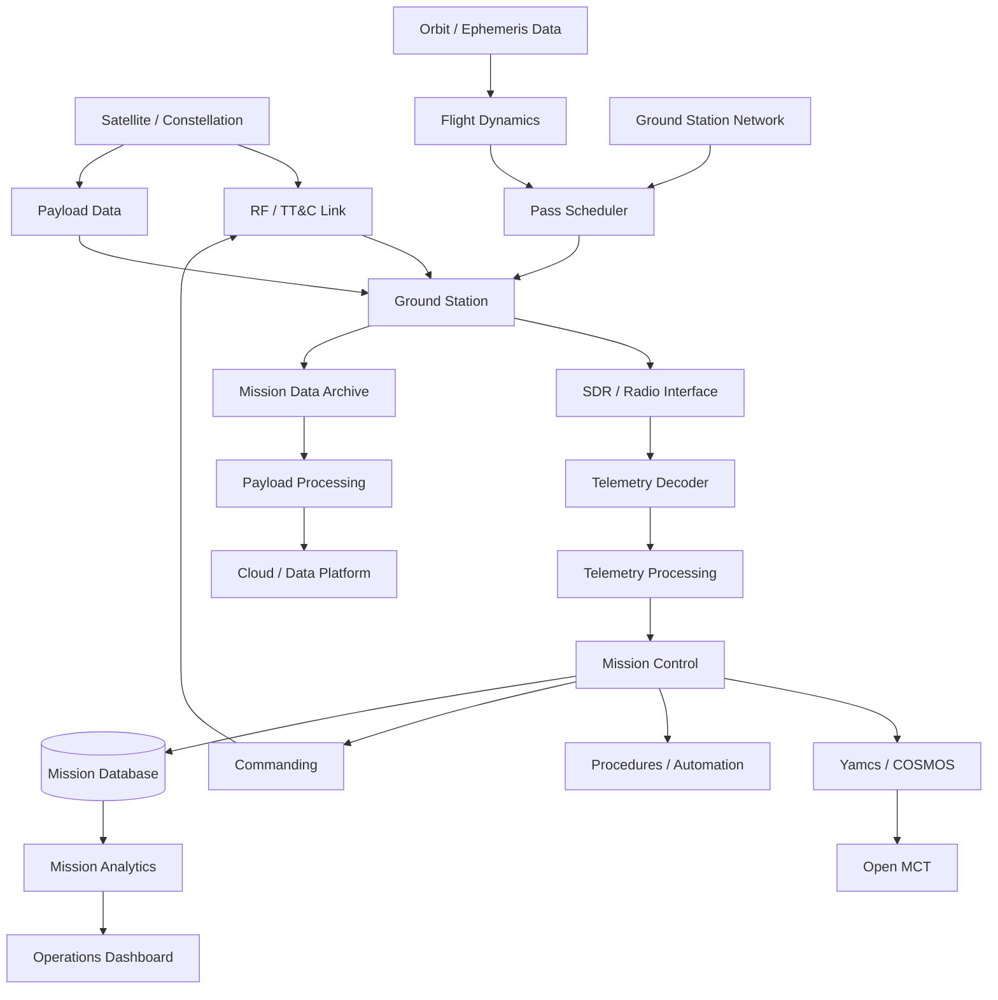
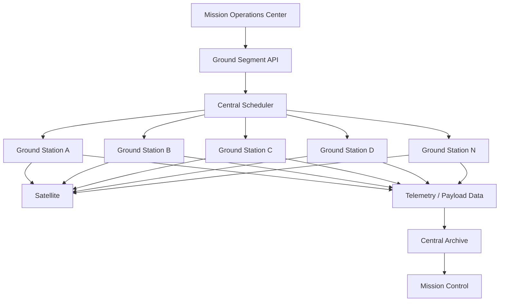
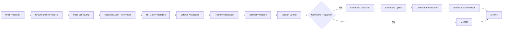
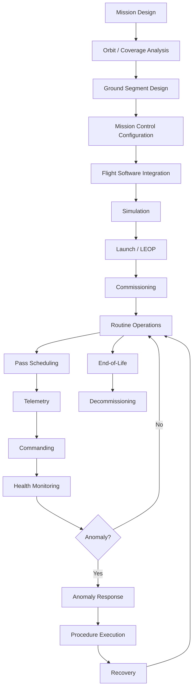

# Awesome-Satellite-Operations

## Top Satellite Operations Ecosystem


**Curated List of SaaS/Hosted Platforms & Open-Source GitHub Projects**

*Focused on Satellite Operations, Mission Control, Ground Segment Management, Ground Station Networks, TT&C, Mission Planning, Telemetry, Commanding, Pass Scheduling, Constellation Operations & Spacecraft Automation*

**Last updated: September 2026**


This repository tracks notable **SaaS/Hosted platforms** and **open-source projects** for **Satellite Operations and Ground Segment Management**. These systems help satellite operators schedule ground-station contacts, command spacecraft, receive telemetry, monitor spacecraft health, automate mission procedures, manage constellations, plan passes, process mission data and coordinate distributed ground infrastructure.


**Examples** include Kratos EPOCH, ATLAS Space Operations, Leaf Space, Infostellar, Azure Orbital, AWS Ground Station, KSATlite, Orbit Logic, Antaris and Scout Space.


Modern satellite-operations platforms increasingly combine **Ground Station as a Service (GSaaS), TT&C, mission planning, spacecraft command and control, telemetry processing, pass scheduling, ground-station orchestration, constellation management, automation, cloud infrastructure, mission simulation and real-time operational dashboards**.


**Open-source emphasis**: This category has a much stronger open-source ecosystem than many specialized enterprise-software categories. Projects such as **SatNOGS, OpenC3 COSMOS, Yamcs, NASA Open MCT, NASA cFS, F Prime, Orekit, GMAT, Basilisk and NOS3** provide substantial building blocks for creating self-hosted satellite-operations infrastructure.


**[SatNOGS](https://satnogs.org/)** is particularly important because it is not merely a satellite-tracking application: it is a modular open-source ground-station stack and global network incorporating station software, scheduling, databases, telemetry dashboards and hardware designs. Libre Space Foundation describes it as a complete open-source networked ground-station platform based on open technologies and standards. ([SatNOGS](https://www.libre.space/projects/satnogs/))


**[OpenC3 COSMOS](https://github.com/OpenC3/cosmos)** provides another major open-source foundation for spacecraft command and control, telemetry decommutation, procedures, scripting, dashboards and hardware/ground-system integration. Its current open-source COSMOS Core supports transports including serial, TCP, UDP, HTTP, MQTT and CCSDS. ([OpenC3](https://openc3.com/cosmos-core))


**[Yamcs](https://github.com/yamcs/yamcs)** is an open-source C3 framework for monitoring and controlling remote systems, with commanding, telemetry processing, mission timelines, procedures, alarms and CCSDS support. ([Yamcs](https://yamcs.org/))


There is **no single open-source platform with complete feature parity with every commercial offering**. The strongest approach is usually to combine:


**Ground Station Network + Scheduling + Mission Control + Telemetry/Commanding + Flight Dynamics + Data Processing + Automation + Dashboards**


Contributions welcome! Open a PR to add/update entries. Clearly distinguish **commercial GSaaS providers**, **mission-control systems**, **ground-station software**, **flight-dynamics tools**, **simulation frameworks** and **supporting infrastructure**.


## Table of Contents


* [SaaS/Hosted Platforms](#saashosted-platforms)

* [Open-Source GitHub Projects](#open-source-github-projects)

* [Open-Source Ground Station Networks](#open-source-ground-station-networks)

* [Open-Source Mission Control & C2](#open-source-mission-control--c2)

* [Open-Source Flight Software](#open-source-flight-software)

* [Open-Source Mission Planning & Flight Dynamics](#open-source-mission-planning--flight-dynamics)

* [Open-Source Satellite Simulation](#open-source-satellite-simulation)

* [Open-Source SDR & Ground Communications](#open-source-sdr--ground-communications)

* [Open-Source Telemetry & Protocol Tools](#open-source-telemetry--protocol-tools)

* [Open-Source Satellite Tracking & Orbit Propagation](#open-source-satellite-tracking--orbit-propagation)

* [Open-Source Mission Data Processing](#open-source-mission-data-processing)

* [Open-Source Analytics & Visualization](#open-source-analytics--visualization)

* [Open-Source Workflow & Automation](#open-source-workflow--automation)

* [Additional Strong Open-Source Options](#additional-strong-open-source-options)

* [Commercial Satellite Operations → Open-Source Equivalents](#commercial-satellite-operations--open-source-equivalents)

* [Frameworks for Building Custom Satellite Operations Systems](#frameworks-for-building-custom-satellite-operations-systems)

* [Reference Satellite Operations Architecture](#reference-satellite-operations-architecture)

* [Typical Satellite Contact Workflow](#typical-satellite-contact-workflow)

* [Mission Operations Lifecycle](#mission-operations-lifecycle)

* [Open-Source Data Model](#open-source-data-model)

* [Open-Source Capability Matrix](#open-source-capability-matrix)

* [Recommended Open-Source Stacks](#recommended-open-source-stacks)

* [What Is Still Difficult to Reproduce in Open Source?](#what-is-still-difficult-to-reproduce-in-open-source)

* [Why Open Source Is Interesting](#why-open-source-is-interesting)

* [How to Contribute](#how-to-contribute)

* [Disclaimer](#disclaimer)


## SaaS/Hosted Platforms

> 📊 **Market Overview**: The global **Ground Segment as a Service (GSaaS)** and satellite operations software market is estimated at **$4.2 Billion to $6.8 Billion (2026)** with a compound annual growth rate of ~16.8%. The ecosystem is transitioning rapidly from dedicated single-owner ground infrastructure to software-defined, cloud-connected aperture networks and multi-mission fleet automation suites. Commercial vendors span cloud hyperscalers (AWS, Azure), established global ground network operators (KSAT, SSC, Viasat), and agile GSaaS software platforms (Leaf Space, ATLAS Space Operations, Infostellar, RBC Signals, Antaris).

| Platform / Product | Description | Starting Pricing | Free Tier / Trial Limits | Network / Company Scale |
| :--- | :--- | :--- | :--- | :--- |
| **[Kratos EPOCH](https://www.kratosspace.com/products/satellites/command-and-control/epoch-ips)** | Enterprise satellite command-and-control (C2) and fleet management suite providing telemetry/command processing, automated procedures, archiving, and multi-mission operations across 300+ deployed missions. | Starting at **$50,000 – $85,000/year** base enterprise license (~$9,570 for individual module add-ons under GSA IT Schedule) | No free-forever plan; **0-day public trial** (custom 30-day proof-of-concept evaluation and virtual demo environment available for qualified satellite operators) | ~$1.1B Rev / $2.8B Mkt Cap (Kratos Defense) |
| **[ATLAS Space Operations](https://www.atlas.space/)** | Ground-segment infrastructure and GSaaS platform providing satellite operators with access to distributed ground stations through the ATLAS Freedom platform and APIs. | Starting at **$2,500/month** base platform subscription (~$150 – $280 per scheduled contact pass) | No free-forever plan; **0-day public trial** (14-day API sandbox and simulation pass testing upon technical onboarding) | 50+ global antennas; ~$15M ARR / $90M Valuation |
| **[Leaf Space](https://leaf.space/)** | Ground Segment as a Service provider offering globally distributed ground stations, automated/on-demand scheduling, TT&C and payload-data connectivity through a unified interface across 40+ active antennas. | Starting at **€2.00 – €3.50/minute** (pay-as-you-go antenna contact time) or **€500/month** entry operational tier (volume discounts available) | No free-forever plan; **0-day public trial** (complimentary RF link compatibility analysis and pre-launch simulated pass verification during mission onboarding) | 40+ antennas across 17 sites; ~$10M ARR / $60M Valuation |
| **[Infostellar / StellarStation](https://www.infostellar.net/)** | Cloud-based satellite ground-segment platform aggregating distributed commercial and university antennas for scalable LEO constellation communications. | Starting at **$100 – $200 per pass** (pay-as-you-go) or **$1,000/month** basic capacity plan; antenna owners earn credits by sharing idle antenna windows | No free-forever plan; **30-day developer sandbox access** with up to 5 simulated API pass schedules (requires satellite transmission registration) | 30+ partner ground stations; ~$6M ARR / $40M Valuation |
| **[Microsoft Azure Orbital](https://azure.microsoft.com/en-us/products/orbital/)** | Azure-based satellite ground-station and space-data service designed to connect spacecraft directly with cloud computing and data-processing infrastructure. | Starting at **$0.22/minute** (narrowband partner downlinks) up to **$10.00/minute** (on-demand direct antenna contact; reserved commitments from $3.00/minute) | **30-day Azure free trial** with $200 cloud credits; 0 free orbital contact minutes included (spacecraft requires FCC/ITU spectrum clearance and NORAD ID validation) | $245B Rev / $3.1T Mkt Cap (Microsoft) |
| **[AWS Ground Station](https://aws.amazon.com/ground-station/)** | Managed ground-station service from AWS providing on-demand satellite communications and direct integration with AWS cloud services. | **$3.00/minute** (Narrowband ≤54 MHz, Reserved commitment of 150 min/month) or **$10.00/minute** (Narrowband On-Demand); **$22.00/minute** (Wideband >54 MHz On-Demand) | **12-month AWS Free Tier** ($300 promotional credit for new accounts); 0 free antenna minutes included (charges accrue per scheduled minute; requires verified satellite licensing) | 12+ global ground station sites; $105B AWS ARR / $2.0T Mkt Cap (Amazon) |
| **[KSATlite](https://www.ksat.no/services/ksatlite/)** | KSAT's global ground-station service aimed at smallsat and constellation operators, providing optimized ground-station access and satellite communications with standardized 3.7m antennas. | Starting at **€150 – €300 per pass** (standard 10–12 minute S/X-band contact) or **€3,000/month** baseline constellation bundle | No free-forever plan; **0-day public trial** (14-day API staging sandbox and simulated contact scheduling available upon sales consultation) | 100+ antennas across 15+ global sites; ~$180M Rev / $1.2B Valuation (KSAT) |
| **[Orbit Logic](https://orbitlogic.com/)** | Space-mission planning and scheduling technology (including STK Scheduler, CPAW, and Order Logic) covering satellite operations, mission planning, resource scheduling and constellation operations. | Starting at **$15,000 – $25,000/year** per software seat license (or starting from $1,250/month commercial license tiers) | No free-forever plan; **30-day evaluation trial license** available for accredited aerospace engineers and government program evaluators | Acquired by Boecore / Auria; ~$25M ARR / $150M Valuation |
| **[Antaris](https://www.antaris.space/)** | Cloud-based space mission virtualization and operations platform supporting mission design, simulation, ground-segment integration, automated CONOPS and software-driven satellite/constellation operations. | Starting at **$2,500/month** ($30,000/year annual project agreement) for core TrueTwin simulation and mission design environments | No free-forever plan; **14-day interactive TrueTwin web sandbox** trial on request (supports 1 virtualized satellite model) | ~$5M ARR / $45M Valuation |
| **[Scout Space](https://www.scout.space/)** | Space-domain-awareness and satellite-operations company developing space-based sensing, optical detection (Owl), autonomous flight software, and SpaceSight™ data intelligence platforms. | Starting at **$2,000/month** ($24,000/year base data feed subscription) for commercial orbital tracking and space-domain intelligence reports | No free-forever plan; **0-day public trial** (sample orbital ephemeris and conjunction dataset available upon request for accredited operators) | ~$8M ARR / $50M Valuation |
| **[Viasat Real-Time Earth](https://www.viasat.com/)** | Commercial Ground Segment as a Service network offering high-rate S-, X-, and Ka-band downlinks, TT&C, and automated machine-to-machine pass scheduling into cloud infrastructure. | Starting at **$15.00 – $25.00/minute** (or ~$150 – $250 per 10-minute pass), with baseline dedicated mission packages from **$5,000/month** | No free-forever plan; **0-day public trial** (technical RF link compatibility analysis and pass simulation provided during onboarding) | 7.3m global antennas; $4.5B Rev / $2.5B Mkt Cap (Viasat, Inc.) |
| **[KSAT](https://www.ksat.no/)** | Large-scale commercial ground-station network providing TT&C, payload-data reception, mission support and ground-segment services, including polar stations Svalbard and TrollSat. | Starting at **€350 – €600 per pass** for high-reliability polar aperture contacts, or annual enterprise mission support starting at **€40,000/year** | No free-forever plan; **0-day public trial** (pre-mission feasibility pass simulation and link budget modeling provided during contract scoping) | 300+ antennas across 28 global sites; ~$180M Rev / $1.2B Valuation (KSAT) |
| **[SSC](https://sscspace.com/)** | Swedish Space Corporation provides satellite ground-station networks (SSC Connect & SSC Infinity), TT&C, mission operations and ground-segment services. | Starting at **€200 – €350 per pass** (SSC Infinity smallsat network) or **€500 – €900 per pass** for high-aperture polar antennas (Kiruna/Santiago) | No free-forever plan; **0-day public trial** (0 free live passes; pre-flight contact simulation and RF link verification during mission setup) | ~$150M Rev / $800M Enterprise Value (Swedish Space Corp) |
| **[RBC Signals](https://rbcsignals.com/)** | Ground-station and satellite-communications marketplace providing access to distributed antennas and mission-support infrastructure. | **$19.95 per pass** (RBC Signals Xpress X-band downlink) with a **$595/month** minimum engagement fee; multi-band TT&C passes start at **$120 – $250/pass** | No free-forever plan; **0-day public trial** (pre-mission link assessment and 1 free simulated API pass reservation upon contract onboarding) | 80+ global antennas across 50+ locations; ~$8M ARR / $45M Valuation |
| **[Atlas Ground Station Network](https://www.atlas.space/)** | Cloud-managed ground-station network with API-oriented scheduling, automated RF modems, and communications infrastructure operated by ATLAS Space Operations. | Starting at **$150 – $280 per pass** (or ~$15 – $25/minute on-demand), with monthly network availability retainers from **$2,500/month** | No free-forever plan; **0-day public trial** (API pass integration sandbox provided during mission onboarding; 0 free live antenna passes) | 50+ federated global antennas; ~$15M ARR / $90M Valuation |


## Open-Source GitHub Projects


### SatNOGS


**[SatNOGS](https://github.com/satnogs)** is one of the most important open-source satellite ground-segment projects.


The Libre Space Foundation's stack includes:


* Ground-station client

* Network scheduling

* Satellite database

* Observation database

* Telemetry dashboards

* GNU Radio integration

* Rotator control

* Antenna designs

* Station automation

* Distributed ground-station networking


SatNOGS is explicitly designed as a modular, scalable satellite-ground-station stack based on open-source technologies and open standards. ([SatNOGS](https://satnogs.org/documentation/))


The network has grown to hundreds of operational stations and millions of observations, making it particularly valuable as a reference for distributed ground-station architecture. ([Libre Space Foundation](https://www.libre.space/projects/satnogs/))


### OpenC3 COSMOS


**[OpenC3 COSMOS](https://github.com/OpenC3/cosmos)** is a mature open-source command-and-control system.


Capabilities include:


* Telemetry decommutation

* Command generation

* Mission consoles

* Procedures

* Scripting

* Telemetry plotting

* Limits

* Event processing

* Hardware integration

* Simulators

* CCSDS

* MQTT

* TCP/UDP

* Serial

* REST/HTTP


COSMOS Core is particularly attractive for CubeSat, laboratory, I&T and constellation-control environments. ([OpenC3](https://openc3.com/cosmos-core))


### Yamcs


**[Yamcs](https://github.com/yamcs/yamcs)** is an open-source Command, Control and Communication framework.


It provides:


* Telemetry processing

* Commanding

* Command stacks

* Procedures

* Mission timelines

* Alarms

* Events

* Data aggregation

* Web interfaces

* CCSDS support

* Distributed operations

* Security features


Yamcs is licensed under AGPL and also has commercial services around the open-source project. ([Yamcs](https://yamcs.org/))


### NASA Open MCT


**[Open MCT](https://github.com/nasa/openmct)** is NASA's open-source mission-control visualization framework.


It can provide:


* Telemetry displays

* Mission dashboards

* Plotting

* Time-based views

* Data visualization

* Planning interfaces

* Plugin architecture


NASA describes Open MCT as a generalizable framework for planning, operation and analysis of systems producing telemetry data. ([NASA Open MCT](https://github.com/nasa/openmct))


### NASA cFS


**[Core Flight System (cFS)](https://github.com/nasa/cFS)** is NASA's open-source flight-software framework.


It provides a reusable architecture for spacecraft flight software and can be integrated with ground systems such as COSMOS and Yamcs. ([NASA cFS](https://github.com/nasa/cFS))


### F Prime


**[F Prime](https://github.com/nasa/fprime)** is NASA's open-source flight-software framework designed for embedded systems and spacecraft.


It provides:


* Flight-software components

* Commanding

* Telemetry

* Events

* Deployment architecture

* Testing

* Simulation

* Ground-data-system integration


### Orekit


**[Orekit](https://github.com/CS-SI/Orekit)** is a powerful open-source space-flight-dynamics library.


It supports:


* Orbit propagation

* Maneuvers

* Visibility

* Ground-station access

* Attitude

* Event detection

* Time systems

* Frames

* Celestial bodies

* Inter-satellite geometry


## Open-Source Ground Station Networks


### SatNOGS


The strongest open-source alternative to commercial distributed ground-station networks is **[SatNOGS](https://satnogs.org/)**.


Its architecture contains:


**Station → Client → Network Scheduler → Observation Database → Dashboard**


It supports both standalone operation and participation in the global network. ([SatNOGS](https://www.libre.space/projects/satnogs/))


### SatNOGS Client


**[SatNOGS Client](https://gitlab.com/librespacefoundation/satnogs/satnogs-client)** provides ground-station control and interfaces with:


* `rigctld`

* `rotctld`

* GNU Radio

* Ground-station hardware

* SatNOGS Network


The official documentation describes the client as Python software targeting Raspberry Pi as the reference architecture. ([SatNOGS](https://wiki.satnogs.org/Software_contribution))


### SatNOGS Network


**[SatNOGS Network](https://gitlab.com/librespacefoundation/satnogs/satnogs-network)** provides:


* Station scheduling

* Observation scheduling

* Network coordination

* Visualization

* Distributed station management


### SatNOGS DB


**[SatNOGS DB](https://gitlab.com/librespacefoundation/satnogs/satnogs-db)** provides satellite and transmitter information used throughout the ecosystem.


### SatNOGS Rotator


**[SatNOGS Rotator](https://gitlab.com/librespacefoundation/satnogs/satnogs-rotator)** provides open-source antenna-rotator hardware/software.


## Open-Source Mission Control & C2


### OpenC3 COSMOS


Best general-purpose open-source option for:


* Command

* Telemetry

* Procedures

* Ground equipment

* Mission consoles

* Testing


### Yamcs


Best for:


* CCSDS missions

* Telemetry processing

* Commanding

* Procedures

* Mission timelines

* Distributed operations


### Open MCT


Best for:


* Mission-control visualization

* Telemetry dashboards

* Operator interfaces

* Planning applications


### NASA cFS + COSMOS


A particularly strong combination is:


**cFS → COSMOS → Open MCT**


where:


* cFS provides flight software

* COSMOS provides command/telemetry operations

* Open MCT provides visualization


### F Prime + Yamcs


Another strong open-source combination is:


**F Prime → Yamcs → Open MCT**


particularly for CubeSat and embedded flight-software projects.


## Open-Source Flight Software


Satellite operations normally interact with flight software through command and telemetry interfaces.


### NASA cFS


**[NASA cFS](https://github.com/nasa/cFS)** provides a generic flight-software architecture used across spacecraft classes.


### F Prime


**[NASA F Prime](https://github.com/nasa/fprime)** provides a component-driven flight-software framework.


### NOS3


**[NASA NOS3](https://github.com/nasa/nos3)** provides a NASA open-source software environment for spacecraft simulation and hardware/software development.


It is particularly useful for:


* Software-in-the-loop

* Hardware-in-the-loop

* Flight-software testing

* Sensor/actuator simulation

* Ground-system testing


### KubOS


**[KubOS](https://github.com/kubos/kubos)** is an open-source flight-software platform for small satellites.


### FreeRTOS


**[FreeRTOS](https://github.com/FreeRTOS/FreeRTOS)** is not spacecraft-specific, but can provide an embedded real-time operating-system foundation for custom spacecraft systems.


### Zephyr


**[Zephyr](https://github.com/zephyrproject-rtos/zephyr)** is another open-source RTOS increasingly useful for embedded aerospace systems.


## Open-Source Mission Planning & Flight Dynamics


### Orekit


**[Orekit](https://github.com/CS-SI/Orekit)** provides one of the strongest open-source flight-dynamics libraries.


Use cases include:


* Orbit propagation

* Ground-station visibility

* Contact windows

* Pass prediction

* Maneuver planning

* Eclipse calculations

* Coordinate transformations

* Event detection


### GMAT


**[NASA GMAT](https://github.com/ChristopherRabotin/GMAT)** is NASA's General Mission Analysis Tool.


It supports:


* Orbit analysis

* Trajectory design

* Mission planning

* Optimization

* Visualization

* Spacecraft propagation


### Basilisk


**[Basilisk](https://github.com/AVSLab/basilisk)** is an open-source spacecraft simulation framework developed at the University of Colorado Boulder.


It supports:


* Spacecraft dynamics

* Attitude control

* Guidance

* Navigation

* Sensors

* Actuators

* Mission scenarios


### poliastro


**[poliastro](https://github.com/poliastro/poliastro)** provides Python tools for astrodynamics and orbital mechanics.


### Skyfield


**[Skyfield](https://github.com/skyfielders/python-skyfield)** provides Python astronomy and satellite-position calculations.


### SGP4


**[python-sgp4](https://github.com/brandon-rhodes/python-sgp4)** provides SGP4 orbit propagation from TLE/OMM-type orbital data.


## Open-Source Satellite Simulation


### Basilisk


Best suited for high-fidelity spacecraft-dynamics simulation.


### NOS3


Useful for spacecraft software/hardware simulation and integrated mission development.


### GMAT


Useful for:


* Orbit design

* Trajectory analysis

* Mission analysis


### Orekit


Useful as a reusable flight-dynamics library embedded into custom applications.


### 42


**[42](https://github.com/ericstoneking/42)** is an open-source spacecraft simulation environment developed by NASA engineer Eric Stoneking.


It supports:


* Spacecraft dynamics

* Attitude

* Sensors

* Actuators

* Orbital simulation


### OpenSIMKit


Open-source simulation environments can also be combined with cFS, F Prime, COSMOS and Yamcs for integrated mission simulations.


## Open-Source SDR & Ground Communications


### GNU Radio


**[GNU Radio](https://github.com/gnuradio/gnuradio)** is a foundational open-source SDR framework.


It can provide:


* Signal processing

* Modulation/demodulation

* SDR control

* Telemetry reception

* Radio experimentation


### gr-satnogs


**[gr-satnogs](https://gitlab.com/librespacefoundation/satnogs/gr-satnogs)** is the GNU Radio module used within the SatNOGS ecosystem for decoding satellite signals. ([SatNOGS](https://gitlab.com/librespacefoundation/satnogs/gr-satnogs))


### gr-satellites


**[gr-satellites](https://github.com/daniestevez/gr-satellites)** is a widely used open-source framework for receiving and decoding telemetry from satellites.


It supports:


* Satellite telemetry decoding

* GNU Radio integration

* Multiple modulation schemes

* Telemetry formats

* Amateur and small-satellite missions


### SDR++


**[SDR++](https://github.com/AlexandreRouma/SDRPlusPlus)** is a cross-platform open-source SDR application.


### Gqrx


**[Gqrx](https://github.com/gqrx-sdr/gqrx)** provides SDR receiver functionality and is useful for ground-station experimentation.


### SoapySDR


**[SoapySDR](https://github.com/pothosware/SoapySDR)** provides a vendor-neutral abstraction layer for SDR hardware.


### GNU Radio Companion


GNU Radio Companion can be used to visually build satellite-radio processing chains.


## Open-Source Telemetry & Protocol Tools


### CCSDS


CCSDS standards form the basis for many professional spacecraft telemetry and telecommand architectures.


Open-source implementations and libraries can be integrated into:


* COSMOS

* Yamcs

* cFS

* F Prime

* GNU Radio


### Yamcs CCSDS


Yamcs provides native support for multiple CCSDS-oriented mission operations workflows.


### NASA cFS


cFS applications can provide command/telemetry services for spacecraft.


### OpenC3 COSMOS


COSMOS supports CCSDS and custom binary protocols through its target/plugin architecture.


### MAVLink


**[MAVLink](https://github.com/mavlink/mavlink)** is not spacecraft-specific, but is useful in certain aerial/space-adjacent and robotic systems.


### MQTT


**[Eclipse Mosquitto](https://github.com/eclipse-mosquitto/mosquitto)** can provide lightweight message transport between ground-system services.


### NATS


**[NATS](https://github.com/nats-io/nats-server)** provides high-performance messaging useful for distributed mission operations.


## Open-Source Satellite Tracking & Orbit Propagation


### Gpredict


**[Gpredict](https://github.com/csete/gpredict)** is an open-source real-time satellite-tracking and orbit-prediction application.


It can:


* Track satellites

* Predict passes

* Control radios

* Control rotators

* Integrate with ground-station equipment


### Skyfield


Useful for Python-based:


* Satellite tracking

* Ephemeris

* Pass prediction

* Astronomical calculations


### Orekit


Best suited to more sophisticated professional flight-dynamics applications.


### poliastro


Useful for Python-centric orbital mechanics and mission-analysis workflows.


### SGP4


Useful for efficient propagation of TLE-based satellite orbits.


### satellite.js


**[satellite.js](https://github.com/shashwatak/satellite-js)** provides JavaScript satellite-orbit propagation.


This is particularly useful for web-based mission-control applications.


## Open-Source Mission Data Processing


### Satpy


**[Satpy](https://github.com/pytroll/satpy)** is an open-source Python library for reading, processing and visualizing satellite remote-sensing data.


### xarray


**[xarray](https://github.com/pydata/xarray)** provides multidimensional scientific-data processing.


### Zarr


**[Zarr](https://github.com/zarr-developers/zarr-python)** provides scalable chunked scientific-data storage.


### Apache Parquet


**[Apache Parquet](https://github.com/apache/parquet-format)** is useful for high-volume telemetry and mission-data storage.


### DuckDB


**[DuckDB](https://github.com/duckdb/duckdb)** can provide efficient local analytics over telemetry and mission datasets.


### Apache Arrow


**[Apache Arrow](https://github.com/apache/arrow)** provides a high-performance columnar data layer.


## Open-Source Analytics & Visualization


### Open MCT


Best mission-specific visualization platform in this list.


### Grafana


**[Grafana](https://github.com/grafana/grafana)** can visualize:


* Telemetry

* Ground-station health

* Contact success

* Signal quality

* Command activity

* Satellite status

* Network availability


### Prometheus


**[Prometheus](https://github.com/prometheus/prometheus)** can monitor:


* Ground stations

* Servers

* APIs

* Mission-control services

* Network components


### Plotly


**[Plotly](https://github.com/plotly/plotly.py)** provides interactive scientific visualization.


### Apache Superset


**[Apache Superset](https://github.com/apache/superset)** can provide mission and ground-segment analytics dashboards.


## Open-Source Workflow & Automation


### Temporal


**[Temporal](https://github.com/temporalio/temporal)** is useful for durable mission-operations workflows:


* Pass scheduling

* Command sequences

* Ground-station reservations

* Data processing

* Anomaly response

* Contact retries

* Operational procedures


### Apache Airflow


**[Apache Airflow](https://github.com/apache/airflow)** can orchestrate:


**Orbit Data → Pass Prediction → Ground Contact → Data Processing → Archive**


### Dagster


**[Dagster](https://github.com/dagster-io/dagster)** can orchestrate mission-data pipelines.


### Prefect


**[Prefect](https://github.com/PrefectHQ/prefect)** can automate mission-data workflows.


### Node-RED


**[Node-RED](https://github.com/node-red/node-red)** can provide low-code event-driven ground-system automation.


## Additional Strong Open-Source Options


* **[SatNOGS](https://github.com/satnogs)** — open-source global ground-station network.

* **[SatNOGS Client](https://gitlab.com/librespacefoundation/satnogs/satnogs-client)** — ground-station control.

* **[SatNOGS Network](https://gitlab.com/librespacefoundation/satnogs/satnogs-network)** — distributed scheduling.

* **[SatNOGS DB](https://gitlab.com/librespacefoundation/satnogs/satnogs-db)** — satellite/transmitter database.

* **[SatNOGS Rotator](https://gitlab.com/librespacefoundation/satnogs/satnogs-rotator)** — open rotator platform.

* **[gr-satnogs](https://gitlab.com/librespacefoundation/satnogs/gr-satnogs)** — satellite signal decoding.

* **[OpenC3 COSMOS](https://github.com/OpenC3/cosmos)** — open-source command/control.

* **[Yamcs](https://github.com/yamcs/yamcs)** — mission control and telemetry.

* **[Open MCT](https://github.com/nasa/openmct)** — mission-control visualization.

* **[NASA cFS](https://github.com/nasa/cFS)** — spacecraft flight software.

* **[F Prime](https://github.com/nasa/fprime)** — flight-software framework.

* **[NOS3](https://github.com/nasa/nos3)** — spacecraft simulation environment.

* **[Orekit](https://github.com/CS-SI/Orekit)** — flight dynamics.

* **[GMAT](https://github.com/ChristopherRabotin/GMAT)** — mission analysis.

* **[Basilisk](https://github.com/AVSLab/basilisk)** — spacecraft simulation.

* **[42](https://github.com/ericstoneking/42)** — spacecraft simulator.

* **[poliastro](https://github.com/poliastro/poliastro)** — Python astrodynamics.

* **[Skyfield](https://github.com/skyfielders/python-skyfield)** — astronomy/satellite tracking.

* **[python-sgp4](https://github.com/brandon-rhodes/python-sgp4)** — SGP4 propagation.

* **[satellite.js](https://github.com/shashwatak/satellite-js)** — JavaScript orbit propagation.

* **[GNU Radio](https://github.com/gnuradio/gnuradio)** — SDR/signal processing.

* **[gr-satellites](https://github.com/daniestevez/gr-satellites)** — telemetry decoding.

* **[SDR++](https://github.com/AlexandreRouma/SDRPlusPlus)** — SDR receiver.

* **[Gqrx](https://github.com/gqrx-sdr/gqrx)** — SDR receiver.

* **[SoapySDR](https://github.com/pothosware/SoapySDR)** — SDR abstraction.

* **[Grafana](https://github.com/grafana/grafana)** — telemetry dashboards.

* **[Prometheus](https://github.com/prometheus/prometheus)** — monitoring.

* **[DuckDB](https://github.com/duckdb/duckdb)** — mission-data analytics.

* **[Satpy](https://github.com/pytroll/satpy)** — satellite-data processing.

* **[xarray](https://github.com/pydata/xarray)** — multidimensional scientific data.

* **[Apache Arrow](https://github.com/apache/arrow)** — high-performance data processing.

* **[Kafka](https://github.com/apache/kafka)** — event streaming.

* **[NATS](https://github.com/nats-io/nats-server)** — messaging.

* **[Mosquitto](https://github.com/eclipse-mosquitto/mosquitto)** — MQTT.

* **[Temporal](https://github.com/temporalio/temporal)** — durable workflow automation.

* **[Airflow](https://github.com/apache/airflow)** — workflow orchestration.

* **[Dagster](https://github.com/dagster-io/dagster)** — data orchestration.

* **[Prefect](https://github.com/PrefectHQ/prefect)** — workflow automation.

* **[Node-RED](https://github.com/node-red/node-red)** — event-driven automation.

* **[OpenSearch](https://github.com/opensearch-project/OpenSearch)** — mission-data search.

* **[PostgreSQL](https://github.com/postgres/postgres)** — operational database.

* **[MinIO](https://github.com/minio/minio)** — object storage.


## Commercial Satellite Operations → Open-Source Equivalents


| Commercial Platform              | Primary Focus                                        | Strong Open-Source Equivalents / Building Blocks          |

| -------------------------------- | ---------------------------------------------------- | --------------------------------------------------------- |

| **Kratos EPOCH**                 | Enterprise satellite C2 / mission operations         | OpenC3 COSMOS + Yamcs + Open MCT + cFS                    |

| **ATLAS Space Operations**       | Ground-station network / GSaaS                       | SatNOGS + custom scheduling + GNU Radio                   |

| **Leaf Space**                   | GSaaS / ground-station network                       | SatNOGS + SatNOGS Network + custom RF infrastructure      |

| **Infostellar / StellarStation** | Cloud ground-segment orchestration                   | SatNOGS + Kubernetes + custom APIs                        |

| **Azure Orbital**                | Cloud-connected satellite ground stations            | SatNOGS + Kubernetes + object storage + cloud APIs        |

| **AWS Ground Station**           | Managed satellite ground-station service             | SatNOGS + GNU Radio + SDR + cloud infrastructure          |

| **KSATlite**                     | Distributed ground-station access                    | SatNOGS + custom ground stations + scheduler              |

| **Orbit Logic**                  | Mission planning / scheduling                        | Orekit + GMAT + Basilisk + custom scheduler               |

| **Antaris**                      | Virtualized mission design / simulation / operations | cFS + F Prime + Yamcs + Orekit + Basilisk                 |

| **Scout Space**                  | Space-domain awareness / satellite sensing           | Open MCT + Orekit + SatNOGS + OpenSearch + custom sensors |


> **Important:** These are **capability-oriented mappings**, not feature-for-feature replacements. Commercial platforms combine proprietary ground infrastructure, RF hardware, network operations, mission-control software, service-level guarantees, cybersecurity, mission support and operational expertise that cannot be reproduced simply by installing one open-source package.


## Frameworks for Building Custom Satellite Operations Systems


A practical open-source satellite-operations stack can be assembled using:


| Layer                 | Open-Source Technologies               |

| --------------------- | -------------------------------------- |

| Ground Network        | SatNOGS                                |

| Ground Station Client | SatNOGS Client                         |

| Scheduling            | SatNOGS Network · custom scheduler     |

| Mission Control       | OpenC3 COSMOS · Yamcs                  |

| Visualization         | Open MCT                               |

| Flight Software       | NASA cFS · F Prime · KubOS             |

| Simulation            | Basilisk · NOS3 · 42                   |

| Flight Dynamics       | Orekit · GMAT · poliastro              |

| Orbit Propagation     | SGP4 · Skyfield · satellite.js         |

| SDR                   | GNU Radio · SDR++ · Gqrx               |

| Satellite Decoding    | gr-satellites · gr-satnogs             |

| RF Abstraction        | SoapySDR                               |

| Telemetry             | Yamcs · COSMOS · cFS                   |

| Commanding            | Yamcs · COSMOS · cFS                   |

| Protocols             | CCSDS · MQTT · UDP/TCP                 |

| Event Streaming       | Kafka · NATS                           |

| Messaging             | MQTT · Mosquitto                       |

| Database              | PostgreSQL                             |

| Time-Series Data      | InfluxDB · TimescaleDB                 |

| Analytics             | DuckDB · Polars · Pandas               |

| Mission Data          | Satpy · xarray · Zarr                  |

| Object Storage        | MinIO                                  |

| Workflow              | Temporal · Airflow · Dagster · Prefect |

| Automation            | Node-RED                               |

| Dashboards            | Grafana · Open MCT                     |

| Monitoring            | Prometheus                             |

| Search                | OpenSearch                             |

| Authentication        | Keycloak · Authentik                   |

| Deployment            | Docker · Kubernetes                    |


## Reference Satellite Operations Architecture





## Distributed Ground Station Architecture





This architecture is conceptually close to the distributed model demonstrated by SatNOGS, where multiple ground stations are coordinated through a shared network and scheduling layer. ([SatNOGS](https://www.libre.space/projects/satnogs/))


## Typical Satellite Contact Workflow





## Mission Operations Lifecycle





## Constellation Operations


A modern constellation-control system needs to manage:


* Hundreds or thousands of spacecraft

* Multiple orbital planes

* Multiple ground stations

* Frequent contacts

* Autonomous procedures

* Telemetry streams

* Command queues

* Software versions

* Configuration versions

* Spacecraft states

* Ground-station availability

* Conflicting contact requests


A suitable open-source architecture is:


**SatNOGS / Scheduler + Orekit + Yamcs/COSMOS + Kafka/NATS + PostgreSQL + Open MCT + Grafana**


## Mission Planning


A mission-planning engine should support:


* Orbit propagation

* Ground-station visibility

* Contact windows

* Eclipse periods

* Power constraints

* Thermal constraints

* Payload operations

* Command windows

* Data-downlink opportunities

* Ground-station availability

* Conflicting activities

* Priority rules

* Spacecraft resources


**Orekit + custom optimization + Yamcs/COSMOS** provides a strong foundation.


## Ground Station Scheduling


A production scheduler should consider:


| Constraint       | Example                               |

| ---------------- | ------------------------------------- |

| Visibility       | Satellite above elevation threshold   |

| Frequency        | UHF / S / X / Ka                      |

| Antenna          | Available antenna                     |

| Location         | Ground-station site                   |

| Polarization     | RHCP / LHCP                           |

| Modulation       | Mission-specific                      |

| Contact duration | Minimum/maximum pass                  |

| Priority         | Critical command vs payload downlink  |

| Conflicts        | Two spacecraft requesting one antenna |

| Weather          | Site-specific RF constraints          |

| Maintenance      | Ground-station outage                 |

| Data volume      | Downlink capacity                     |

| Orbit            | LEO / MEO / GEO / deep space          |


## Telemetry Architecture


```text

Satellite

   ↓

RF Link

   ↓

Ground Station

   ↓

SDR / Radio

   ↓

Demodulator

   ↓

Frame Decoder

   ↓

CCSDS / Mission Protocol

   ↓

Telemetry Database

   ↓

Mission Control

   ↓

Open MCT / Grafana

```


Possible open-source components:


**GNU Radio + gr-satellites/gr-satnogs + Yamcs/COSMOS + PostgreSQL + Open MCT**


## Command Architecture


A robust command path should be:


```text

Operator

   ↓

Mission Console

   ↓

Command Validation

   ↓

Procedure / Command Stack

   ↓

Command Authorization

   ↓

Ground System

   ↓

RF Modem

   ↓

Ground Station

   ↓

Satellite

   ↓

Command Verification

   ↓

Telemetry Confirmation

```


OpenC3 COSMOS and Yamcs both provide important pieces for this architecture.


## Open-Source Data Model


A serious satellite-operations system should model at least the following.


### Spacecraft


* Spacecraft ID

* NORAD ID

* COSPAR ID

* Mission

* Bus

* Payload

* Orbit

* Status

* Software version

* Configuration version

* Owner

* Operational state


### Ground Station


* Ground station ID

* Location

* Latitude

* Longitude

* Antenna

* Frequency bands

* Modulation

* RF chains

* Availability

* Maintenance status

* Network endpoint


### Contact Window


* Contact ID

* Spacecraft

* Ground station

* AOS

* LOS

* Maximum elevation

* Duration

* Priority

* Status


### Telemetry


* Parameter

* Timestamp

* Value

* Unit

* Quality

* Source

* Spacecraft

* Ground station

* Packet ID


### Command


* Command ID

* Spacecraft

* Operator

* Procedure

* Parameters

* Timestamp

* Authorization

* Execution status

* Verification status


### Procedure


* Procedure ID

* Version

* Purpose

* Steps

* Preconditions

* Commands

* Expected telemetry

* Recovery actions


### Mission Event


* Event ID

* Timestamp

* Spacecraft

* Event type

* Severity

* Source

* Operator

* Resolution


## Mission Operations Database


A practical architecture can use:


### PostgreSQL


For:


* Spacecraft

* Ground stations

* Contacts

* Commands

* Procedures

* Operators

* Mission events


### TimescaleDB


For:


* High-volume telemetry

* Time-series data

* Sensor measurements


### MinIO


For:


* Payload data

* Telemetry archives

* Command logs

* Mission files

* Simulation results


### DuckDB


For:


* Mission analysis

* Telemetry analytics

* Pass analysis

* Large CSV/Parquet datasets


## Open-Source Capability Matrix


| Capability                    | Commercial Platforms | Strong Open-Source Options                     |

| ----------------------------- | -------------------: | ---------------------------------------------- |

| Ground Station Network        |                    ✓ | SatNOGS                                        |

| GSaaS                         |                    ✓ | SatNOGS + custom infrastructure                |

| Pass Scheduling               |                    ✓ | SatNOGS · Orekit                               |

| Ground Contact Planning       |                    ✓ | SatNOGS · Orekit · custom scheduler            |

| Satellite Tracking            |                    ✓ | Gpredict · Skyfield · SGP4                     |

| Flight Dynamics               |                    ✓ | Orekit · GMAT · Basilisk                       |

| Mission Planning              |                    ✓ | Orekit · GMAT · custom optimization            |

| Command & Control             |                    ✓ | COSMOS · Yamcs                                 |

| Telemetry Processing          |                    ✓ | Yamcs · COSMOS · cFS                           |

| Mission Visualization         |                    ✓ | Open MCT · Grafana                             |

| Flight Software               |                    ✓ | cFS · F Prime · KubOS                          |

| Spacecraft Simulation         |                    ✓ | Basilisk · NOS3 · 42                           |

| SDR                           |                    ✓ | GNU Radio · SDR++                              |

| Satellite Decoding            |                    ✓ | gr-satellites · gr-satnogs                     |

| CCSDS                         |                    ✓ | Yamcs · COSMOS · custom                        |

| Automated Procedures          |                    ✓ | COSMOS · Yamcs · Temporal                      |

| Ground Equipment Control      |                    ✓ | COSMOS · SatNOGS                               |

| Constellation Operations      |                    ✓ | COSMOS/Yamcs + custom orchestration            |

| Mission Data Archive          |                    ✓ | PostgreSQL · MinIO · Parquet                   |

| Telemetry Analytics           |                    ✓ | Grafana · DuckDB                               |

| Cloud Integration             |                    ✓ | Kubernetes · MinIO · Kafka                     |

| Event Streaming               |                    ✓ | Kafka · NATS                                   |

| Monitoring                    |                    ✓ | Prometheus · Grafana                           |

| Self-Hosting                  |              Limited | ✓                                              |

| Source-Code Access            |              Limited | ✓                                              |

| Enterprise SLA                |                    ✓ | Community / commercial support varies          |

| Managed Global Ground Network |                    ✓ | SatNOGS community network / own infrastructure |


## Recommended Open-Source Stacks


### #1 — Complete Open-Source Ground Station


**SatNOGS + GNU Radio + gr-satnogs + Gpredict**


Best for:


* CubeSats

* Universities

* Amateur satellites

* Research

* Distributed ground stations


### #2 — Professional Mission Control


**Yamcs + Open MCT + PostgreSQL + Orekit**


Best for:


* Telemetry

* Commanding

* Mission timelines

* Flight dynamics

* Operator consoles


### #3 — NASA-Oriented Architecture


**cFS + COSMOS + Open MCT + Orekit**


Best for:


* NASA-derived architectures

* Spacecraft development

* I&T

* Simulation

* Mission operations


### #4 — CubeSat Mission


**F Prime + Yamcs + Open MCT + Orekit + GNU Radio**


Best for:


* Small satellites

* University missions

* New-space missions

* Rapid development


### #5 — Distributed Constellation


**COSMOS/Yamcs + SatNOGS + Orekit + Kafka + PostgreSQL + Open MCT**


Best for:


* Multiple spacecraft

* Multiple ground stations

* Automated operations

* Distributed mission control


### #6 — Fully Open Satellite Simulation


**Basilisk + cFS/F Prime + NOS3 + COSMOS/Yamcs + Orekit**


Best for:


* Hardware-in-the-loop

* Software-in-the-loop

* Mission simulation

* Operator training


## Strongest Open-Source Combination


For organizations attempting to build a broad open-source equivalent to the commercial ecosystem represented by **Kratos EPOCH, ATLAS, Leaf Space, Infostellar, Azure Orbital, AWS Ground Station and Orbit Logic**, a particularly strong architecture is:


**SatNOGS + COSMOS/Yamcs + Open MCT + Orekit + cFS/F Prime + GNU Radio + PostgreSQL + Kafka + Grafana**


This provides the major functional layers:


**Ground Network → Scheduling → RF → Telemetry → Commanding → Flight Dynamics → Mission Control → Automation → Analytics**


## What Is Still Difficult to Reproduce in Open Source?


Open-source software is exceptionally strong for satellite operations, but several areas remain difficult to reproduce at commercial scale:


* Global ground-station coverage

* High-availability ground infrastructure

* Commercial RF hardware

* Certified RF equipment

* Antenna maintenance

* 24/7 network operations

* Global site acquisition

* Spectrum coordination

* RF licensing

* Guaranteed pass availability

* Commercial SLA

* Mission-critical cybersecurity

* Enterprise fleet management

* Large constellation optimization

* Proprietary flight-dynamics algorithms

* Automated anomaly response

* Commercial mission-support teams

* Deep-space ground infrastructure

* Ka-band/X-band high-throughput infrastructure

* Space-to-ground network redundancy

* Global regulatory compliance


This means the **software layer can be largely open**, while the physical ground infrastructure and operational service layer often remain commercial.


## Open Source vs GSaaS


It is important to distinguish:


### Open-Source Software


Examples:


* SatNOGS

* COSMOS

* Yamcs

* Open MCT

* Orekit

* GNU Radio

* cFS

* F Prime


### Open Hardware


Examples:


* SatNOGS antenna/rotator designs

* SDR hardware interfaces

* Amateur-radio equipment


### Commercial GSaaS


Examples:


* ATLAS

* Leaf Space

* Infostellar

* AWS Ground Station

* Azure Orbital

* KSAT


An organization can therefore combine both:


**Open-Source Mission Control + Commercial GSaaS**


For example:


**Yamcs → Leaf Space / ATLAS API → Ground Station → Satellite**


This hybrid architecture can dramatically reduce the amount of proprietary mission-control software required.


## Hybrid Open-Source Ground Segment


A practical production architecture can be:


```text

                    MISSION CONTROL

                          |

                  Open MCT / COSMOS

                          |

                        Yamcs

                          |

                    Mission API

                          |

                Ground Segment API

                    /           \

                   /             \

          Commercial GSaaS     Own Ground Station

          /      |      \          |

      ATLAS    Leaf    AWS        SatNOGS

                |       |          |

                +-------+----------+

                        |

                     Satellite

```


Antaris documentation provides a particularly interesting example of this hybrid approach: its ground-communications abstraction can integrate third-party providers such as **ATLAS Space Operations and Leaf Space** through APIs, while also allowing first-party ground-station integrations. ([Antaris](https://docs.antaris.space/ground-communications))


## Ground Station as a Service API


A modern open architecture should abstract the ground station behind an API.


Example conceptual interface:


```text

POST /contacts

GET  /contacts

GET  /stations

GET  /passes

POST /command

GET  /telemetry

GET  /station-status

```


This allows the mission-control system to switch between:


* Own ground station

* SatNOGS station

* Commercial GSaaS

* University ground station

* Backup ground station


without rewriting the spacecraft-control software.


## Autonomous Satellite Operations


The long-term direction of satellite operations is increasingly autonomous.


An open-source autonomous architecture could combine:


**Telemetry → Rules → State Estimation → Procedure Selection → Command Validation → Commanding**


For example:


```text

Telemetry

   ↓

Health Assessment

   ↓

Anomaly Detection

   ↓

Mission Rule

   ↓

Procedure Selection

   ↓

Command Validation

   ↓

Operator Approval

   ↓

Command Uplink

   ↓

Verification

```


Potential open-source components include:


* Yamcs

* COSMOS

* cFS

* F Prime

* Temporal

* PyOD

* scikit-learn

* River

* Grafana

* Open MCT


## AI/ML for Satellite Operations


Open-source AI can assist with:


* Telemetry anomaly detection

* Predictive maintenance

* Battery forecasting

* Thermal prediction

* Attitude anomalies

* RF anomaly detection

* Ground-station fault prediction

* Contact-quality prediction

* Scheduling optimization

* Payload-data classification


Useful projects include:


* **[PyOD](https://github.com/yzhao062/pyod)** — anomaly detection.

* **[River](https://github.com/online-ml/river)** — online machine learning.

* **[scikit-learn](https://github.com/scikit-learn/scikit-learn)** — classical ML.

* **[PyTorch](https://github.com/pytorch/pytorch)** — deep learning.

* **[TensorFlow](https://github.com/tensorflow/tensorflow)** — machine learning.


## Mission Operations Digital Twin


A particularly powerful open-source architecture is:


**Flight Software + Simulator + Ground System + Flight Dynamics + Mission Data**


For example:


**cFS/F Prime + NOS3/Basilisk + COSMOS/Yamcs + Orekit + Open MCT**


This enables operators and developers to run:


* Nominal scenarios

* Fault scenarios

* Command validation

* Procedure testing

* Telemetry simulation

* Ground-system testing

* Operator training

* Anomaly-response rehearsals


before transmitting commands to a real spacecraft.


## Open-Source Satellite Operations Reference Architecture


```text

┌───────────────────────────────────────────────────────┐

│                 MISSION OPERATIONS                    │

│                                                       │

│        Open MCT / COSMOS / Yamcs                     │

└───────────────────────┬───────────────────────────────┘

                        │

                 Mission Services

                        │

        ┌───────────────┼────────────────┐

        │               │                │

     Planning       Command          Telemetry

        │               │                │

     Orekit          COSMOS           Yamcs

     GMAT            cFS/F Prime      cFS

        │               │                │

        └───────────────┼────────────────┘

                        │

                 Ground Segment

                        │

        ┌───────────────┼────────────────┐

        │               │                │

     SatNOGS        Own Station       GSaaS

        │               │          ATLAS / Leaf

        │               │          AWS / Azure

        └───────────────┼────────────────┘

                        │

                   RF / TT&C

                        │

                    SATELLITE

```


## Open-Source Capability Mapping


### Kratos EPOCH


**Commercial strength:** Enterprise C2, telemetry, commanding, procedures, scheduling, automation and fleet operations.


**Open-source combination:**


**COSMOS + Yamcs + Open MCT + cFS + Orekit**


### ATLAS Space Operations


**Commercial strength:** Ground-station infrastructure and network orchestration.


**Open-source combination:**


**SatNOGS + GNU Radio + SatNOGS Network + custom APIs**


### Leaf Space


**Commercial strength:** GSaaS and distributed ground-station connectivity.


**Open-source combination:**


**SatNOGS + scheduler + custom RF stations**


### Infostellar


**Commercial strength:** Cloud-based ground-segment orchestration.


**Open-source combination:**


**SatNOGS + Kubernetes + PostgreSQL + custom ground-station API**


### Azure Orbital / AWS Ground Station


**Commercial strength:** Cloud-integrated ground-station services.


**Open-source combination:**


**SatNOGS + MinIO + Kubernetes + Kafka + GNU Radio**


### Orbit Logic


**Commercial strength:** Mission planning and scheduling.


**Open-source combination:**


**Orekit + GMAT + Basilisk + custom optimization**


### Antaris


**Commercial strength:** Mission virtualization, simulation and software-defined operations.


**Open-source combination:**


**Basilisk + cFS/F Prime + Orekit + Yamcs + Open MCT**


## Best Open-Source Starting Points


### #1 — SatNOGS


**Best overall open-source ground-segment ecosystem.**


Use for:


* Ground stations

* Distributed networks

* Satellite tracking

* Scheduling

* Telemetry reception

* RF experimentation


### #2 — OpenC3 COSMOS


**Best general-purpose open-source C2 platform.**


Use for:


* Commanding

* Telemetry

* Procedures

* Ground equipment

* Mission consoles


### #3 — Yamcs


**Best open-source mission-control framework for CCSDS-oriented operations.**


Use for:


* Telemetry

* Commanding

* Procedures

* Mission timelines

* Distributed operations


### #4 — Open MCT


**Best open-source mission-control visualization layer.**


Use for:


* Operator consoles

* Telemetry visualization

* Mission dashboards

* Planning interfaces


### #5 — Orekit


**Best open-source flight-dynamics foundation.**


Use for:


* Orbit propagation

* Visibility

* Pass prediction

* Mission analysis


### #6 — cFS / F Prime


**Best open-source spacecraft flight-software foundations.**


Use for:


* Spacecraft software

* Embedded systems

* Command/telemetry integration

* Simulation


### #7 — Basilisk / NOS3


**Best open-source simulation foundations.**


Use for:


* Mission simulation

* Operator training

* Hardware/software integration

* Fault scenarios


## Overall Open-Source Recommendation


For a serious modern open-source alternative to the **Kratos EPOCH + ATLAS + Leaf Space + Infostellar + Orbit Logic + Antaris** ecosystem, a particularly strong architecture is:


**SatNOGS + OpenC3 COSMOS + Yamcs + Open MCT + Orekit + cFS/F Prime + GNU Radio + Basilisk/NOS3 + PostgreSQL + Kafka**


with:


**Orbit Prediction → Ground Station Scheduling → RF Contact → Telemetry → Mission Control → Commanding → Verification → Archive → Analytics**


This is one of the more mature areas for open-source aerospace software because NASA, universities, research organizations and the open-space community have produced substantial reusable software for flight dynamics, flight software, mission control, telemetry, SDR and ground-station operations.


## How to Contribute


1. Fork the repo.

2. Add/edit entries in `README.md` following the existing format.

3. Include the official website or GitHub repository.

4. Clearly identify whether the project is **SaaS/Hosted**, **Open Source**, **Open Hardware**, or an **open-source building block**.

5. Include license information when known.

6. Prefer actively maintained repositories.

7. Distinguish mission-control software from ground-station software.

8. Distinguish flight software from ground software.

9. Add new open-source flight-dynamics tools.

10. Add new ground-station schedulers and SDR projects.

11. Include relevant CCSDS/telemetry/commanding projects.

12. Submit a PR with a short explanation.


Star the repo if you find it useful!


## Disclaimer


* This is a **community-curated** list — not exhaustive and not an endorsement.

* Commercial products and trademarks belong to their respective owners.

* Open-source projects listed here are not necessarily feature-for-feature replacements for commercial satellite-operations platforms.

* Some projects are mission-control systems; others are flight-software frameworks, ground-station systems, SDR libraries, simulators, flight-dynamics libraries or visualization frameworks.

* Open-source software does not automatically provide commercial ground-station infrastructure.

* RF hardware, antennas, amplifiers, spectrum licensing and regulatory approvals may still be required.

* Satellite operations are safety- and mission-critical activities and require appropriate validation before commanding real spacecraft.

* Flight software, command sequences and autonomous procedures should be tested extensively in simulation and hardware-in-the-loop environments.

* CCSDS and other protocol implementations should be validated against the mission's specific requirements.

* Ground-station availability, RF licensing and geographic coverage should be independently verified.

* Licensing should always be checked against the current project release.

* Production deployments should undergo security, reliability, timing, RF, communications and mission-specific validation.

* Commercial GSaaS services and their APIs may require separate contracts and service agreements.

* No open-source project listed here should be assumed to provide flight-qualified or mission-qualified software without independent verification.


---


**Made for satellite operators, CubeSat teams, NewSpace companies, universities, research laboratories, mission-control engineers, ground-segment engineers, RF engineers, flight-software developers, constellation operators and organizations building open and self-hosted satellite-operations infrastructure.**

Let's make satellite operations more open, interoperable, automatable, scalable, reproducible and accessible.
